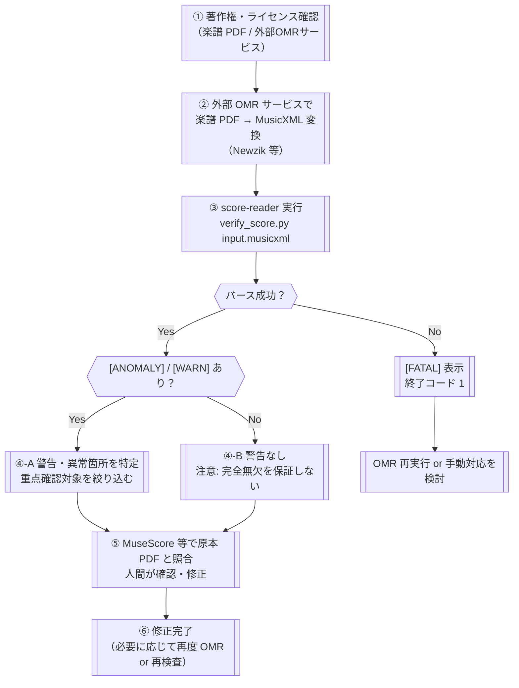

# UI and Flow Design（UI・フロー設計）

<!-- Document Info（文書情報） -->
| Item（項目） | Value（値） |
|---|---|
| Document ID（文書ID） | UI-001 |
| Version（バージョン） | 0.2 |
| Status（ステータス） | Draft |
| Created Date（作成日） | 2026-06-21 |
| Last Updated（最終更新日） | 2026-06-21 |
| Owner（管理者） | Takashi Oikawa |
| Related Documents（関連文書） | README.md / 02_REQUIREMENTS_DEFINITION.md / 03_DATA_AND_SECURITY_DESIGN.md / 05_ARCHITECTURE_DESIGN.md / legacy/SCORE_READER_BASIC_DESIGN.md / legacy/MULTI_OMR_BASIC_DESIGN.md |

---

## Table of Contents（目次）

1. [Purpose（目的）](#1-purpose目的)
2. [Scope（対象範囲）](#2-scope対象範囲)
3. [Out of Scope（対象外範囲）](#3-out-of-scope対象外範囲)
4. [Assumptions（前提条件）](#4-assumptions前提条件)
5. [Definition Details（定義内容）](#5-definition-details定義内容)
6. [Open Issues（未決事項）](#6-open-issues未決事項)
7. [Handoff to Detail Design（詳細設計への引き継ぎ）](#7-handoff-to-detail-design詳細設計への引き継ぎ)
8. [Change History（変更履歴）](#8-change-history変更履歴)

---

## 1. Purpose（目的）

本文書は、score-reader プロトタイプの CLI 操作フロー・入力選択フロー・出力確認フロー・人間レビューフロー・エラー処理フロー・著作権確認フローを定義し、実装・運用フェーズの基準とすることを目的とする。

score-reader は GUI を持たないローカル実行 CLI ツールである。本文書は画面設計書としてではなく、**CLI 操作・出力確認・人間レビューの業務フロー設計書**として位置づける。

本文書のフロー設計は「人間確認の省略」を目的としない。score-reader の役割は確認対象を絞り込むことであり、最終的な正確性の担保は人間による原本 PDF 照合で行う。本文書の対象読者は、設計者・実装者・利用者・プロジェクトオーナーである。

---

## 2. Scope（対象範囲）

| 対象 | 内容 |
|---|---|
| CLI インターフェース | コマンドライン引数・実行コマンド・出力形式の選択 |
| ユーザー操作フロー | 著作権確認 → 外部 OMR 実行 → score-reader 実行 → 出力確認 → 人間レビュー の一連の業務フロー |
| 出力確認フロー | テキスト出力・JSON 出力の読み取り方・警告・異常の判断方針 |
| 人間レビューフロー | score-reader 出力を受けた後、MuseScore 等で原本 PDF と照合する作業フロー |
| エラー・警告処理フロー | `[FATAL]` / `[ANOMALY]` / `[WARN]` の対処フロー |
| 著作権・ライセンス確認フロー | 外部 OMR サービス利用前・テスト素材追加前の著作権確認手順 |

---

## 3. Out of Scope（対象外範囲）

| 対象外項目 | 理由 |
|---|---|
| GUI 画面設計・ワイヤーフレーム | score-reader は CLI ツールであり、画面を持たない |
| Web UI・モバイル UI | プロトタイプフェーズは CLI のみ対象とする |
| アクセシビリティ基準・レスポンシブ対応 | GUI を持たないため対象外 |
| 外部 OMR サービスの操作 UI | score-reader のスコープ外（利用者が外部サービスを操作する） |
| MuseScore 等の楽譜編集ソフトの操作 | 既存の外部ツールであり、score-reader のフロー設計対象外 |
| 完全自動化フロー（人間確認を省略するフロー） | score-reader の設計原則に反する（§4 参照） |

---

## 4. Assumptions（前提条件）

本文書の内容が成立するために必要な前提は `01_REQUEST_DEFINITION.md` §4 を継承する。以下は UI・フロー設計フェーズで追加する前提を示す。

- 利用者は Python 実行環境・仮想環境のセットアップが完了していること（環境構築手順は `06_OPERATION_AND_HANDOFF.md` に記載する）
- 利用者は MuseScore 等の楽譜編集ソフトを別途用意し、原本 PDF との照合を行う意図があること
- score-reader の CLI 出力（テキスト/JSON）は「確認対象情報」であり、利用者はそれを正解として採用しないこと
- score-reader は人間確認を省略するためのツールではなく、確認対象を絞り込むためのツールであること
- 本プロジェクトのライセンスは **CC BY-NC-SA 4.0**（LICENSE ファイル参照）であり、非商用・継承ライセンスの条件が適用されること
- 本文書の v0.1 日付は、移行元 Legacy Source（`legacy/SCORE_READER_BASIC_DESIGN.md`）の初版コミット日（2026-06-07）を引き継ぐ

---

## 5. Definition Details（定義内容）

### 5.1 CLI Interface Definition（CLI インターフェース定義）

画面一覧は対象外。理由: score-reader は CLI ツールであり、画面を持たない。代わりに CLI インターフェース仕様を定義する。

#### コマンド仕様

| 項目 | 内容 |
|---|---|
| 実行ファイル | `prototype/src/verify_score.py` |
| 作業ディレクトリ | score-reader リポジトリルート |
| 仮想環境 | `.venv`（有効化後に実行） |

#### 引数・フラグ

| 引数 / フラグ | 必須 | 型 | 内容 |
|---|---|---|---|
| `input`（第 1 引数） | 必須 | ファイルパス（文字列） | 検査対象の MusicXML ファイルパス（絶対・相対いずれも可） |
| `--json` | 任意 | フラグ | 指定時: JSON 形式で標準出力。未指定時: 人間可読テキスト形式 |

#### 実行コマンド例

```bash
# 人間可読テキスト形式（デフォルト）
python3 verify_score.py ../tests/<file>.musicxml

# JSON 形式
python3 verify_score.py ../tests/<file>.musicxml --json

# JSON をファイルに保存する場合（利用者がリダイレクトで対応）
python3 verify_score.py ../tests/<file>.musicxml --json > result.json
```

#### 終了コード

| 終了コード | 条件 |
|---|---|
| `0` | パース成功（検査完了） |
| `1` | パース失敗（`[FATAL]` 出力後） |

### 5.2 User Flow Overview and Business Flow（ユーザーフロー全体・業務フロー）

画面遷移図は対象外（CLI ツールのため）。代わりに業務フロー全体を Mermaid で示す。

#### 全体業務フロー



#### フローの設計上の重要事項

| 事項 | 内容 |
|---|---|
| 完全自動化禁止 | フロー中に「人間確認を省略して完了する」分岐を設けない |
| 警告なし≠正確 | `[WARN]` / `[ANOMALY]` が 0 件でも原本 PDF 照合（⑤）を省略しない |
| OMR 出力は確認対象 | ② の OMR 出力 MusicXML を正解として扱わない |
| 複数 OMR の活用（任意） | 同一 PDF を複数 OMR サービスで変換・比較することで、③〜④ の絞り込み精度を高められる（単独では正解を保証しない） |

### 5.3 Wireframes and Layout Policy（ワイヤーフレーム・レイアウト方針）

本文書では対象外。理由: score-reader は CLI ツールであり、画面・レイアウトを持たない。

### 5.4 Operation Flow and User Scenarios（CLI 操作フロー・ユーザーシナリオ）

#### SC-001: 基本検査フロー（テキスト出力）

| 項目 | 内容 |
|---|---|
| シナリオ概要 | 単一 MusicXML を score-reader で検査し、テキスト出力を確認する基本フロー |
| 前提条件 | 仮想環境が有効化済み。入力 MusicXML を用意済み。著作権確認済み |

```bash
# 1. リポジトリルートへ移動
cd <score-reader-repository-root>

# 2. 仮想環境を有効化（初回構築済みの場合）
source .venv/bin/activate

# 3. prototype/src へ移動
cd prototype/src

# 4. 検査実行（テキスト形式）
python3 verify_score.py ../tests/<file>.musicxml

# 5. 出力を確認し、[ANOMALY] / [WARN] がある箇所を記録する
# 6. MuseScore 等で原本 PDF と照合・修正
```

#### SC-002: JSON 出力フロー（後工程ツールへの渡し）

| 項目 | 内容 |
|---|---|
| シナリオ概要 | 検査結果を JSON 形式で取得し、ファイル保存または後工程ツールへ渡す |
| 前提条件 | SC-001 と同様 |

```bash
# JSON 形式で出力し、ファイルに保存
python3 verify_score.py ../tests/<file>.musicxml --json > result.json

# JSON ファイルを確認
cat result.json
```

#### SC-003: 入力ファイル選択フロー

| 項目 | 内容 |
|---|---|
| シナリオ概要 | 検査対象 MusicXML ファイルを選択・指定する手順 |
| 著作権確認 | **実行前に、入力 MusicXML の著作権状況を確認すること**（§5.6 参照） |

| ステップ | 内容 |
|---|---|
| 1. 著作権確認 | 対象 MusicXML がパブリックドメインか、利用者が著作権保護状況を確認済みであること |
| 2. OMR 出力の確認 | 外部 OMR サービスで生成した MusicXML を取得済みであること |
| 3. ファイルパスの指定 | 絶対パスまたは `prototype/src/` からの相対パスで指定する |
| 4. テスト素材の場合 | `prototype/tests/` 配下の素材はパブリックドメインのみ配置されている |

#### SC-004: 出力確認フロー（Output Review Flow）

| 出力要素 | 確認すべき内容 | 次のアクション |
|---|---|---|
| `[FATAL]` あり | パース失敗。MusicXML が破損・非対応形式の可能性 | OMR 再実行 または 手動対応を検討 |
| `[ANOMALY]` あり | 小節長と拍子の不一致など構造上の異常 | 該当小節を優先的に人間確認する |
| `[WARN]` あり | 要確認箇所（拍子未確定・リハーサルマーク・和音音数・パート間小節数不一致 等） | 警告箇所をリストアップし、原本 PDF と照合する |
| `[INFO]` あり | 参考情報（単音が和音として記譜・無音高要素の件数） | 必要に応じて原本 PDF で確認する |
| 警告・異常がすべて 0 件 | **注意: 完全無欠を保証しない。** 音高・声部・タイ/スラー等は検査対象外 | 原本 PDF との目視照合を省略しない |

#### SC-005: 人間レビューフロー（Human Review Flow）

score-reader の出力確認後、人間が実施すべき作業フローを示す。

| ステップ | 実施者 | 内容 |
|---|---|---|
| 1. 警告・異常箇所の整理 | 利用者 | `[ANOMALY]` → `[WARN]` の順に重点確認対象をリストアップ |
| 2. 警告なし箇所の扱い | 利用者 | 警告なしでも「完全無欠の保証なし」として原本照合対象に含める |
| 3. MuseScore で MusicXML を開く | 利用者 | OMR 出力 MusicXML を MuseScore 等で開く |
| 4. 原本 PDF との照合 | 利用者 | score-reader が指摘した箇所を中心に原本 PDF と目視照合 |
| 5. 修正・確認 | 利用者 | 誤認識・欠落を修正する。音高の正誤は人間が判断する |
| 6. 複数 OMR との比較（任意） | 利用者 | 複数 OMR の結果を比較し、一致・不一致箇所で優先度を判断する（一致=正解ではない） |
| 7. 最終確認 | 利用者 | 原本 PDF との全体照合で最終的な正確性を担保する |

### 5.5 Validation and Error Handling Policy（入力バリデーション・エラーハンドリング方針 / CLI 層）

#### Warning / Error Handling Flow（警告・エラー処理フロー）

| 出力レベル | 発生条件 | 表示方針 | 利用者の対処フロー |
|---|---|---|---|
| `[FATAL]` | MusicXML パース失敗 | 標準出力に `[FATAL]` メッセージを出力し、終了コード 1 で終了 | OMR 再実行・MusicXML の形式確認・手動対応を検討する |
| `[ANOMALY]` | 小節長と拍子の不一致 | 該当パート・小節番号とともに出力 | 原本 PDF で該当小節を最優先で確認する |
| `[WARN]` | 要確認の疑い（拍子未確定・リハーサルマーク・和音音数・パート間不一致 等） | 該当箇所の情報とともに出力 | 警告箇所をリストアップし、原本 PDF と照合する |
| `[INFO]` | 参考情報（単音の和音記譜・無音高要素件数 等） | 参考情報として出力 | 必要に応じて確認する |
| 警告・異常なし | 検査対象の構造的問題が検出されなかった | 完全無欠を保証しない旨の注記を出力 | **原本 PDF 照合を省略しない** |

#### 入力バリデーション

| Target（対象） | Validation Rules（バリデーションルール） | Error Message / Display Policy |
|---|---|---|
| 入力ファイルパス（第 1 引数） | ファイルが存在すること。`music21.converter.parse` が対応する形式であること | パース失敗時: `[FATAL]` を標準出力に出力し、終了コード 1 で終了 |
| `--json` フラグ | 指定・未指定いずれも有効。他の引数との競合なし | 無効なフラグ: Python 標準 `argparse` のエラーメッセージを出力 |

### 5.6 License / Copyright Check Flow（著作権・ライセンス確認フロー）

score-reader 本体のライセンスは **CC BY-NC-SA 4.0**（LICENSE ファイル参照）。非商用・継承ライセンス条件が適用される。

#### 楽譜素材を扱う前の確認フロー

```
著作権確認チェック（外部 OMR サービス利用前・テスト素材追加前に実施）

□ 1. 対象楽譜の著作権状況を確認する
        → パブリックドメイン: 続行可
        → 著作権保護中: リポジトリへの登録禁止。外部 OMR 送信前に利用規約を確認する

□ 2. 外部 OMR サービスの利用規約を確認する
        → 送信データ（楽譜 PDF / 画像）の二次利用・学習利用等の条件を確認する
        → 利用規約に問題なければ OMR 実行へ進む

□ 3. テスト素材として prototype/tests/ に追加する場合
        → パブリックドメインのみ許可
        → 追加前にリポジトリのレビュー担当者が著作権状況を確認する

□ 4. score-reader の出力ファイルを保存・共有する場合
        → 出力ファイルに著作権保護楽譜の内容が実質的に含まれないことを確認する
```

#### score-reader 本体の利用条件（CC BY-NC-SA 4.0）

| 条件 | 内容 |
|---|---|
| 非商用（NonCommercial） | score-reader およびその派生物を商業目的で利用しない |
| 継承（ShareAlike） | score-reader を改変・再配布する場合は、同一ライセンス（CC BY-NC-SA 4.0）を適用する |
| 表示（Attribution） | score-reader を利用・再配布する場合は、原著者（Takashi Oikawa）を表示する |

#### アクセシビリティ・レスポンシブ対応

本文書では対象外。理由: score-reader は CLI ツールであり、GUI・画面を持たない。

---

## 6. Open Issues（未決事項）

| ID | Open Issue（未決事項） | Owner（担当者） | Due Date（期限） | Status（ステータス） |
|---|---|---|---|---|
| TBD-001 | 将来フェーズで複数 MusicXML 比較機能を実装する場合の CLI フロー（引数設計・出力形式）を定義するか。 | Takashi Oikawa | 未定 | Open |
| TBD-002 | `[WARN]` / `[ANOMALY]` の優先度付けフロー（どの警告を最初に確認すべきかの指針）を設計書として定義するか。 | Takashi Oikawa | 未定 | Open |
| TBD-003 | 著作権確認チェックリスト（§5.6）をドキュメントとして正式化・運用化するか。 | Takashi Oikawa | 未定 | Open |

---

## 7. Handoff to Detail Design（詳細設計への引き継ぎ）

アーキテクチャ設計（`05_ARCHITECTURE_DESIGN.md`）・実装フェーズへ引き継ぐ主要事項を示す。

1. **「警告なし＝正確」の誤解防止を出力に組み込むこと**: `[WARN]` / `[ANOMALY]` が 0 件であっても「完全無欠を保証しない」注記を必ず出力に含めること（SC-004・§5.5 参照）。

2. **終了コードの仕様を実装に徹底すること**: パース成功時: 0、パース失敗時: 1。スクリプトによる自動処理と人間の目視確認を両立するための仕様であること（§5.1 参照）。

3. **CLI 引数の設計を変更する場合は本文書を更新すること**: 将来フェーズで引数・フラグを追加・変更する場合は §5.1 CLI インターフェース定義を更新し、SC シナリオを追加すること。

4. **著作権確認フローの周知**: 利用者向けドキュメント（README 等）に、実行前の著作権確認・外部 OMR サービス利用規約確認を明示すること（§5.6 参照）。

---

## 8. Change History（変更履歴）

| Version（バージョン） | Date（日付） | Changes（変更内容） | Author（変更者） |
|---|---|---|---|
| 0.1 | 2026-06-07 | Legacy Source 初版（legacy/SCORE_READER_BASIC_DESIGN.md 初版コミット日を引き継ぐ） | Takashi Oikawa |
| 0.2 | 2026-06-21 | 標準7文書への移行・記入。legacy/SCORE_READER_BASIC_DESIGN.md（初版 2026-06-07）・legacy/MULTI_OMR_BASIC_DESIGN.md（初版 2026-06-04）・01〜03 各設計書・LICENSE ファイルを参照し全セクションを記入 | Takashi Oikawa |
