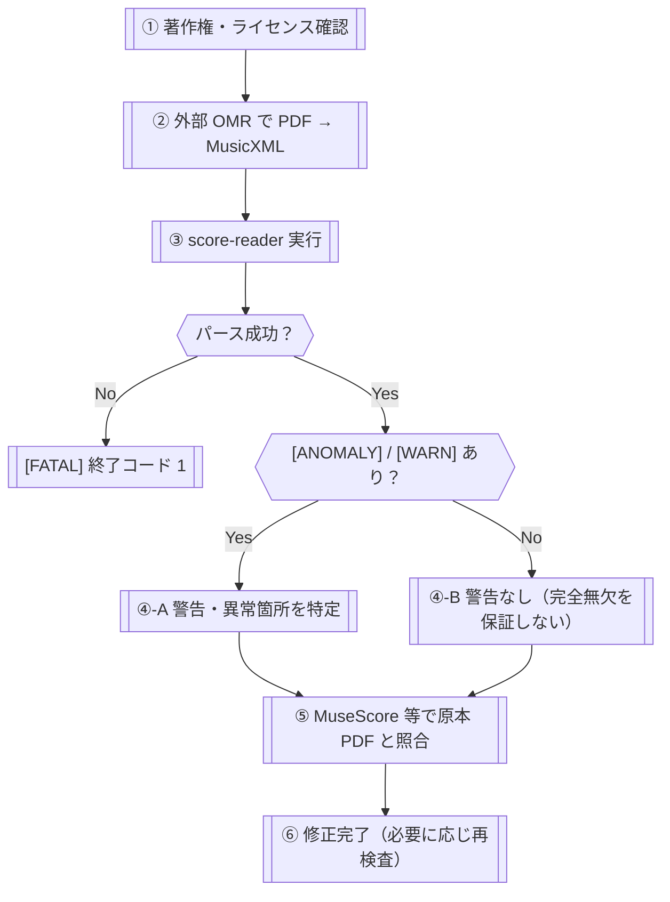

# UI and Flow Design（UI・フロー設計）

<!-- Document Info（文書情報） -->
| Item（項目） | Value（値） |
|---|---|
| Document ID（文書ID） | UI-001 |
| Version（バージョン） | 0.3.2 |
| Status（ステータス） | Draft |
| Created Date（作成日） | 2026-06-09 |
| Last Updated（最終更新日） | 2026-09-06 |
| Owner（管理者） | Takashi Oikawa |
| Related Documents（関連文書） | README.md / 02_REQUIREMENTS_DEFINITION.md / 03_DATA_AND_SECURITY_DESIGN.md / 05_ARCHITECTURE_DESIGN.md / docs/reviews/2026-09-06_SCORE_READER_DESIGN_REVIEW.md |

---

## Table of Contents（目次）

1. [Purpose（目的）](#1-purpose目的)
2. [Scope（対象範囲）](#2-scope対象範囲)
3. [Out of Scope（対象外範囲）](#3-out-of-scope対象外範囲)
4. [Assumptions（前提条件）](#4-assumptions前提条件)
5. [Definition Details（定義内容）](#5-definition-details定義内容)
6. [Open Issues（未決事項）](#6-open-issues未決事項)
7. [Handoff to Detail Design（詳細設計への引き継ぎ）](#7-handoff-to-detail-design詳細設計への引き継ぎ)
8. [Change History（変更履歴）](#8-change-history変更履歴)

---

## 1. Purpose（目的）

本文書は**現行プロトタイプ**における `verify_score.py`（単一 MusicXML 構造検査の検証実装）の CLI 操作フロー・出力確認フロー・人間レビューフローを定義し、実装・運用フェーズの基準とすることを目的とする。

開発段階の分類は `README.md` §1 Development Stage Classification を参照する。現行は CLI である。Web UI は将来検討事項である。本実装確定スコープ（複数 MusicXML 入力、正規化、比較可能性判定、差分比較、差分可視化、比較レポート生成）の CLI フロー詳細は、本文書の Open Issues（TBD-001）で管理する。比較機能の実装可否は確定済みである。最終的な正確性の担保は人間による原本 PDF 照合で行う。本文書の対象読者は、設計者・実装者・利用者・プロジェクトオーナーである。

---

## 2. Scope（対象範囲）

| 対象 | 内容 |
|---|---|
| CLI インターフェース | コマンドライン引数・実行コマンド・出力形式の選択 |
| ユーザー操作フロー | 著作権確認 → 外部 OMR 実行 → score-reader 実行 → 出力確認 → 人間レビュー |
| 出力確認フロー | テキスト出力・JSON 出力の読み取り方・警告・異常の判断方針 |
| 人間レビューフロー | score-reader 出力を受けた後、MuseScore 等で原本 PDF と照合する作業フロー |
| エラー・警告処理フロー | `[FATAL]` / `[ANOMALY]` / `[WARN]` の対処フロー |
| 著作権・ライセンス確認フロー | 外部 OMR サービス利用前・テスト素材追加前の確認手順 |

---

## 3. Out of Scope（対象外範囲）

| 対象外項目 | 理由 |
|---|---|
| GUI 画面設計・ワイヤーフレーム | score-reader は CLI ツールであり、画面を持たない |
| Web UI・モバイル UI | プロトタイプ検証段階は CLI のみ対象とする |
| 原本 PDF 横並び画面 | 将来検討事項（`README.md` §1 Development Stage Classification 参照） |
| MusicXML 自動修正 UI | 同上。score-reader は検査結果の出力のみ |
| 外部 OMR サービスの操作 UI | score-reader のスコープ外 |
| 完全自動化フロー（人間確認を省略するフロー） | 設計原則に反する |

---

## 4. Assumptions（前提条件）

本文書の内容が成立するために必要な前提は `01_REQUEST_DEFINITION.md` §4 を継承する。以下は UI・フロー設計フェーズで追加する前提を示す。

- 利用者は Python 実行環境・仮想環境のセットアップが完了していること（環境構築手順は `06_OPERATION_AND_HANDOFF.md` に記載）
- 利用者は MuseScore 等の楽譜編集ソフトを別途用意し、原本 PDF との照合を行う意図があること
- score-reader の CLI 出力は「確認対象情報」であり、正解として採用しないこと
- ライセンスは分離構成を正とする。ソースコードは MIT License（`LICENSE-CODE`）、設計文書・README・作業ルールは CC BY-NC-SA 4.0（`LICENSE-DOCS`）。`LICENSE` は旧ライセンス記録として残置する。テスト素材は両区分に自動含めない

---

## 5. Definition Details（定義内容）

### 5.1 Screen List — Detail Definition（画面一覧・詳細定義）

プロトタイプ検証段階は GUI を持たないため、画面一覧は対象外とする。代わりに CLI インターフェース仕様を定義する。

| Screen ID（画面ID） | Screen Name（画面名） | Input Items（入力項目） | Output Items（出力項目） | Main Operations（主要操作） | Notes（備考） |
|---|---|---|---|---|---|
| CLI-001 | verify_score.py 実行 | 第 1 引数: MusicXML ファイルパス。任意: `--json` | 標準出力: 検査結果（テキスト or JSON）。終了コード 0/1 | 検査実行・出力確認 | 実行ファイル: `prototype/src/verify_score.py` |

#### 引数・フラグ

| 引数 / フラグ | 必須 | 内容 |
|---|---|---|
| `input`（第 1 引数） | 必須 | 検査対象 MusicXML ファイルパス |
| `--json` | 任意 | パース成功時、JSON 形式で標準出力 |

#### 実行コマンド例

```bash
python3 verify_score.py ../tests/<file>.musicxml
python3 verify_score.py ../tests/<file>.musicxml --json
python3 verify_score.py ../tests/<file>.musicxml --json > result.json
```

現行実装では、`--json` 指定時でも入力のパースに失敗すると JSON ではなくプレーンテキストの `[FATAL]` が標準出力へ出る。リダイレクト先にも JSON は書き込まれない。将来の JSON エラー形式は未確定である（`02_REQUIREMENTS_DEFINITION.md` §5.7 FUT-002）。

### 5.2 Screen Transition and Business Flow（画面遷移図・業務フロー）

画面遷移は対象外（CLI ツールのため）。業務フロー全体を以下に示す。



| 事項 | 内容 |
|---|---|
| 完全自動化禁止 | 人間確認を省略して完了する分岐を設けない |
| 警告なし≠正確 | `[WARN]` / `[ANOMALY]` 0 件でも原本 PDF 照合（⑤）を省略しない |
| OMR 出力は確認対象 | ② の MusicXML を正解として扱わない |
| パース失敗時の `--json` | 現行は JSON にならない。プレーンテキスト `[FATAL]` |

### 5.3 Wireframes and Layout Policy（主要画面のワイヤーフレーム・レイアウト方針）

本文書では対象外。理由: プロトタイプ検証段階は CLI ツールであり、画面・レイアウト・原本 PDF 横並び UI を持たない。

### 5.4 Operation Flow and User Scenarios（操作フロー・ユーザーシナリオ）

要求定義の成功基準 ID（`01_REQUEST_DEFINITION.md` SC-001〜SC-009）と混同しないため、操作シナリオ ID は `FLOW-` を用いる。

| Scenario ID（シナリオID） | Operation Name（操作名） | Steps（操作手順） |
|---|---|---|
| FLOW-001 | 基本検査フロー（テキスト出力） | 1. リポジトリルートで仮想環境を有効化 → 2. `cd prototype/src` → 3. `python3 verify_score.py ../tests/<file>.musicxml` → 4. 出力の `[ANOMALY]` / `[WARN]` を記録 → 5. MuseScore 等で原本 PDF と照合 |
| FLOW-002 | JSON 出力フロー | 1. FLOW-001 と同様の前提 → 2. `--json` 指定で実行 → 3. パース成功時のみ JSON になる。パース失敗時はプレーンテキスト `[FATAL]` → 4. 必要に応じリダイレクトで保存 → 5. 後工程または照合作業で参照 |
| FLOW-003 | 入力ファイル選択フロー | 1. 著作権状況を確認（楽曲の権利、MusicXML エンコーディングの権利、加工・再配布条件を分離） → 2. 外部 OMR 出力 MusicXML を用意 → 3. ファイルパスを第 1 引数に指定 |
| FLOW-004 | 出力確認フロー | 1. `[FATAL]`: OMR 再実行または形式確認。`--json` 指定でも現行は JSON にならない → 2. `[ANOMALY]`: 該当小節を最優先照合 → 3. `[WARN]`: リストアップして原本 PDF 照合 → 4. 警告 0 件: 完全無欠を保証しない旨を確認し照合を省略しない |
| FLOW-005 | 人間レビューフロー | 1. 警告・異常箇所を整理 → 2. MuseScore で MusicXML を開く → 3. 原本 PDF と目視照合・修正 → 4. 必要に応じ score-reader を再実行 |

#### 著作権確認チェック（FLOW-003 補足）

```
□ 対象楽譜の著作権状況を確認した
□ MusicXML エンコーディングの権利・利用条件を確認した
□ 外部 OMR サービスの利用規約を確認した
□ テスト素材追加時は楽曲の権利、エンコーディング、加工・再配布条件を分けて確認した
```

### 5.5 Validation and Error Handling Policy（バリデーション・エラーハンドリング方針 / UI層）

| Target（対象） | Validation Rules（バリデーションルール） | Error Message / Display Policy（エラーメッセージ・表示方針） |
|---|---|---|
| 入力ファイルパス | ファイルが存在し、`music21.converter.parse` が読み込める形式であること | パース失敗: プレーンテキスト `[FATAL]` を標準出力へ出し終了コード 1。`--json` 指定時も現行は JSON にならない |
| `--json` フラグ | 指定・未指定いずれも有効 | 無効なフラグ: `argparse` 標準エラー |

| 出力レベル | 利用者の対処フロー |
|---|---|
| `[FATAL]` | OMR 再実行・MusicXML 形式確認・手動対応を検討 |
| `[ANOMALY]` | 該当小節を最優先で原本 PDF 照合 |
| `[WARN]` | 警告箇所をリストアップし原本 PDF 照合 |
| `[INFO]` | 必要に応じて確認 |
| 警告・異常なし | 原本 PDF 照合を省略しない |

### 5.6 Accessibility and Responsive Design Policy（アクセシビリティ・レスポンシブ対応方針）

本文書では対象外。理由: プロトタイプ検証段階は CLI ツールであり、GUI・画面を持たない。

---

## 6. Open Issues（未決事項）

| ID | Open Issue（未決事項） | Owner（担当者） | Due Date（期限） | Status（ステータス） |
|---|---|---|---|---|
| TBD-001 | 本実装確定スコープである複数 MusicXML 比較の CLI フロー（引数設計・出力形式）の詳細化。実装するか自体は確定済み。Web UI は将来検討であり本 TBD の対象外。 | Takashi Oikawa | 未定 | Open |
| TBD-002 | `[WARN]` / `[ANOMALY]` の優先度付けフローを設計書として定義するか。 | Takashi Oikawa | 未定 | Open |
| TBD-003 | 著作権確認チェックリストを正式化・運用化するか。 | Takashi Oikawa | 未定 | Open |

JSON エラー形式は `02_REQUIREMENTS_DEFINITION.md` §5.7 FUT-002 で未確定のまま管理する。

---

## 7. Handoff to Detail Design（詳細設計への引き継ぎ）

1. **「警告なし＝正確」の誤解防止**: `[WARN]` / `[ANOMALY]` 0 件でも「完全無欠を保証しない」注記を必ず出力に含めること。
2. **終了コードの徹底**: パース成功 0、パース失敗 1。
3. **CLI 引数変更時は本文書を更新**: 引数・フラグ追加時は §5.1 と FLOW シナリオを更新すること。
4. **著作権確認フローの周知**: 利用者向けドキュメントに実行前の著作権確認を明示すること。
5. **`--json` 時のパース失敗**: 現行は JSON にならない。将来形式は未確定であり、決定済みとして記載しない。

---

## 8. Change History（変更履歴）

| Version（バージョン） | Date（日付） | Changes（変更内容） | Author（変更者） |
|---|---|---|---|
| 0.1 | 2026-06-09 | 初版作成 | Takashi Oikawa |
| 0.2 | 2026-06-28 | 正本記入・開発段階分類表記統一 | Takashi Oikawa |
| 0.3 | 2026-09-06 | 設計レビュー反映。分離ライセンス構成へ修正。操作シナリオ ID を FLOW-001〜FLOW-005 に変更。`--json` 時のパース失敗が非 JSON である現行制約を明記 | Takashi Oikawa |
| 0.3.1 | 2026-09-06 | 設計レビュー差し戻し反映。複数 MusicXML 比較を本実装確定スコープとし、CLI フロー詳細のみ TBD-001 に残す。Web UI は将来検討のまま | Takashi Oikawa |
| 0.3.2 | 2026-09-06 | 文書表現の整理。CLI 現行・Web UI 将来検討・複数 MusicXML 比較の本実装確定を維持。仕様の追加・変更は行っていない | Takashi Oikawa |
