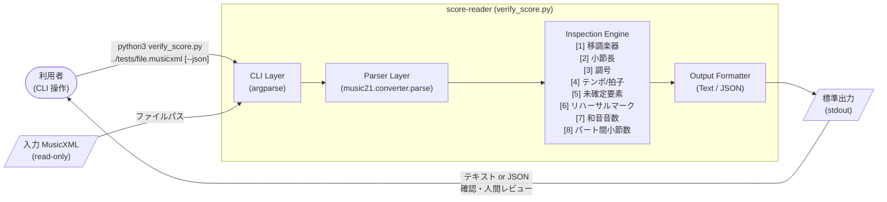
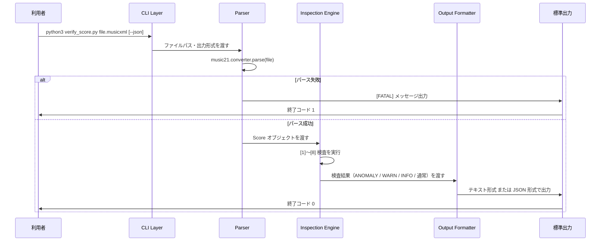

# Architecture Design（アーキテクチャ設計）

<!-- Document Info（文書情報） -->
| Item（項目） | Value（値） |
|---|---|
| Document ID（文書ID） | ARCH-001 |
| Version（バージョン） | 0.2 |
| Status（ステータス） | Draft |
| Created Date（作成日） | 2026-06-21 |
| Last Updated（最終更新日） | 2026-06-21 |
| Owner（管理者） | Takashi Oikawa |
| Related Documents（関連文書） | README.md / 02_REQUIREMENTS_DEFINITION.md / 03_DATA_AND_SECURITY_DESIGN.md / 04_UI_AND_FLOW_DESIGN.md / 06_OPERATION_AND_HANDOFF.md / legacy/SCORE_READER_BASIC_DESIGN.md / legacy/MULTI_OMR_BASIC_DESIGN.md |

---

## Table of Contents（目次）

1. [Purpose（目的）](#1-purpose目的)
2. [Scope（対象範囲）](#2-scope対象範囲)
3. [Out of Scope（対象外範囲）](#3-out-of-scope対象外範囲)
4. [Assumptions（前提条件）](#4-assumptions前提条件)
5. [Definition Details（定義内容）](#5-definition-details定義内容)
6. [Open Issues（未決事項）](#6-open-issues未決事項)
7. [Handoff to Detail Design（詳細設計への引き継ぎ）](#7-handoff-to-detail-design詳細設計への引き継ぎ)
8. [Change History（変更履歴）](#8-change-history変更履歴)

---

## 1. Purpose（目的）

本文書は、score-reader プロトタイプのシステム構成・コンポーネント責務・技術スタック・処理フロー・アーキテクチャ制約・拡張ポイントを定義し、実装フェーズの基準とすることを目的とする。

score-reader は本番サービスではなく、OMR 出力 MusicXML の内部整合性検査を行う Prototype / 検証支援ツールである。本文書は本番グレードのアーキテクチャ設計書としてではなく、**プロトタイプ構成の設計記録**として位置づける。

本文書の対象読者は、設計者・実装者・プロジェクトオーナーである。

---

## 2. Scope（対象範囲）

| 対象 | 内容 |
|---|---|
| システム | score-reader プロトタイプ（`prototype/src/verify_score.py`） |
| フェーズ | プロトタイプ・技術検証フェーズ |
| 実行形態 | ローカル実行 CLI ツール（単一 Python スクリプト） |
| 処理対象 | 単一 MusicXML ファイルの内部整合性検査 |
| 出力 | 標準出力（テキスト形式 / JSON 形式） |
| 依存ライブラリ | `music21 10.3.0`（`prototype/requirements.txt` 参照） |

---

## 3. Out of Scope（対象外範囲）

| 対象外項目 | 理由 |
|---|---|
| 本番グレードのアーキテクチャ設計 | プロトタイプフェーズを対象とする。将来フェーズの拡張ポイントは §5.5 に記載する |
| データベース設計 | score-reader はデータを永続化しない（`03_DATA_AND_SECURITY_DESIGN.md` 参照） |
| 複数 MusicXML の比較・差分処理アーキテクチャ | プロトタイプフェーズのスコープ外（TBD-001） |
| GUI・Web UI アーキテクチャ | CLI ツールのためプロトタイプフェーズは対象外（TBD-002） |
| 外部 OMR サービス API 連携 | プロトタイプフェーズでは外部 API 連携を持たない（TBD-003） |
| スケーリング・冗長化・フェイルオーバー | ローカル実行ツールのためプロトタイプフェーズは対象外 |
| クラウドデプロイ・コンテナ化 | プロトタイプフェーズのスコープ外 |

---

## 4. Assumptions（前提条件）

本文書の内容が成立するために必要な前提は `01_REQUEST_DEFINITION.md` §4 を継承する。以下はアーキテクチャ設計フェーズで追加する前提を示す。

**Prototype の境界（Prototype Boundary）**

- `verify_score.py` は Prototype / 技術検証用であり、正式完成版ではない
- プロトタイプの設計は「現技術で検出できることを最小限の構成で実現する」ことを優先する
- スケーラビリティ・可用性・セキュリティ強化は将来フェーズの拡張対象とする（§5.5 参照）
- プロトタイプのアーキテクチャを正式版に直接採用する場合は、設計見直しが必要である

**アーキテクチャ制約（Architecture Constraints）**

- 依存ライブラリは `music21 10.3.0` のみとする。外部依存を最小化する
- 入力は 1 実行 = 1 MusicXML ファイル に制限する
- 出力は標準出力のみとする。入力ファイルを変更しない（非破壊）
- 音高・音価・声部の正誤を自動判定する機能を実装しない（現技術の限界）
- `[WARN]` / `[ANOMALY]` 0 件であっても完全無欠を保証しないアーキテクチャとする
- 本文書の v0.1 日付は、移行元 Legacy Source（`legacy/SCORE_READER_BASIC_DESIGN.md`）の初版コミット日（2026-06-07）を引き継ぐ

---

## 5. Definition Details（定義内容）

### 5.1 System Architecture Diagram（システム構成図・Architecture Overview）

#### コンポーネント構成図



#### 処理フロー（Processing Flow）



### 5.2 Technology Stack and Rationale（技術スタック・採用理由）

| Type（種別） | Technology（採用技術） | Version（バージョン） | Rationale（採用理由） |
|---|---|---|---|
| Language（言語） | Python | 3.x（`python3` コマンド） | MusicXML 解析ライブラリ music21 が Python で提供されるため。プロトタイプ実装の生産性が高い |
| Library（ライブラリ） | music21 | 10.3.0 | MusicXML の構造化読み取り・パート/小節/音価/拍子/調号等の要素へのアクセスが可能な OSS。プロトタイプの技術検証において最も成熟した Python MusicXML 解析ライブラリ |
| CLI Parsing（引数解析） | argparse（Python 標準） | Python 3.x 同梱 | 外部依存を増やさず CLI 引数・フラグ（`--json`）を処理できる。標準ライブラリのため追加インストール不要 |
| Framework（フレームワーク） | なし | — | プロトタイプフェーズでは単一スクリプト構成を採用。フレームワークは不要 |
| Database（DB） | なし | — | データを永続化しない設計。`03_DATA_AND_SECURITY_DESIGN.md` §5.1 参照 |
| Infrastructure（インフラ） | ローカル環境（Python 仮想環境） | `.venv` | プロトタイプのためクラウド・コンテナ不要。OS 依存なし（Python 3.x が動作する環境であれば可） |
| Package Management（パッケージ管理） | pip + requirements.txt | — | `prototype/requirements.txt` で依存ライブラリを固定管理する |

**完全自動化が困難な技術要因（音高・音価・声部）**

| 要因 | 内容 | アーキテクチャ上の対応 |
|---|---|---|
| 音高判定の不確実性 | 加線・符頭位置・調号・臨時記号・オクターブ違いにより確定できない | music21 から読み取れる構造情報のみを出力し、正誤判定は行わない |
| 音価・リズム判定の不確実性 | 符尾・連桁・付点・連符・休符の誤認識により小節内拍数が崩れうる | [2] 小節長検算で拍子との不一致を検出するに留め、正解の特定は人間に委ねる |
| 声部分離の不安定性 | 同一譜表内複数声部の扱いが OMR ツール間で異なる | 構造的な音価合計の検算のみ実施。声部分離の正誤は判定しない |
| MusicXML 表現差 | 同じ楽譜内容でも OMR ツールごとに XML 表現が異なる | music21 の抽象化層を介して読み取ることで、表現差を吸収する範囲に限定する |

### 5.3 Module Structure and Layer Design（モジュール構成・コンポーネント責務）

#### プロトタイプのモジュール構成

プロトタイプフェーズは単一スクリプト（`verify_score.py`）で全機能を実装する。将来フェーズでのモジュール分割は §5.5 拡張ポイントに記載する。

```
prototype/
├── src/
│   └── verify_score.py    ← エントリポイント（全コンポーネントを内包）
├── tests/
│   └── *.musicxml          ← テスト素材（パブリックドメイン楽譜のみ）
└── requirements.txt        ← 依存ライブラリ固定（music21==10.3.0）
```

#### コンポーネント責務（Component Responsibilities）

| コンポーネント | 責務 | 実装の位置づけ |
|---|---|---|
| **CLI Layer** | コマンドライン引数（入力ファイルパス・`--json` フラグ）の解析。入力バリデーション（ファイル存在確認はパース層に委ねる）。出力形式の選択 | `argparse` を使用。プロトタイプでは `verify_score.py` 内に実装 |
| **Parser Layer** | `music21.converter.parse()` による MusicXML の読み込み。パース失敗時は `[FATAL]` を出力し終了コード 1 で終了 | music21 ライブラリに依存。プロトタイプでは `verify_score.py` 内に実装 |
| **Inspection Engine** | 検査項目 [1]〜[8] の実行。各検査の結果（ANOMALY / WARN / INFO / 通常）を生成。「推測しない・断定しない」設計原則を実装で保持する | プロトタイプでは `verify_score.py` 内の関数として実装 |
| **Output Formatter** | 検査結果をテキスト形式（人間可読）または JSON 形式に変換して標準出力へ出力。`[WARN]`/`[ANOMALY]` 0 件時の「完全無欠を保証しない」注記を含める | プロトタイプでは `verify_score.py` 内に実装 |

#### 検査エンジン（Inspection Engine）の検査項目と参照範囲

| 検査 ID | 機能 | 参照範囲 | 判定しないこと |
|---|---|---|---|
| [1] 移調楽器チェック | 移調楽器情報の有無・半音差・方向を報告 | 全パート | 移調情報の正誤・欠落の確定 |
| [2] 小節長の検算 | 拍子記号に対する音価合計の不一致を検出 | 全パート・全小節 | どちらが正しいか |
| [3] 調号の列挙 | 調号の出現小節・シャープ/フラット数を列挙 | **第 1 パートのみ**（制約） | 調号の正誤 |
| [4] テンポ/拍子変化イベント | 拍子・テンポ変化を小節番号順に列挙 | **第 1 パートのみ**（制約） | テンポの正誤 |
| [5] 未確定・要確認要素 | `Unpitched`（無音高）要素の件数を報告 | 全パート | 完全無欠の保証 |
| [6] リハーサルマーク対応表 | リハーサルマークと小節番号の対応を列挙 | 全パート（重複排除） | マークの正誤・意味 |
| [7] 和音音数チェック | 和音構成音数の分布と主流音数からの乖離を報告 | 全パート | 何音であるべきか |
| [8] パート間小節数整合 | パート間の小節数一致・不一致を検出 | 全パート | どのパートが正しいか |

### 5.4 External Integration and API Design（外部依存・API設計方針）

#### 外部依存（External Dependency）

プロトタイプフェーズでは外部サービス連携を持たない。score-reader が依存する外部要素を示す。

| 連携先 / 依存先 | 連携方式 | 用途・概要 | プロトタイプ上の制約 |
|---|---|---|---|
| music21 ライブラリ | Python パッケージ（pip install） | MusicXML の構造化読み取り・Score オブジェクト生成 | バージョンを `10.3.0` に固定する |
| ローカルファイルシステム | OS ファイルアクセス | 入力 MusicXML の読み取り（read-only） | 書き込み・削除・派生ファイル生成は禁止 |
| 標準出力（stdout） | Python `print()` / `json.dumps()` | 検査結果の出力 | ファイル保存は利用者のリダイレクトに委ねる |
| 外部 OMR サービス（Newzik 等） | score-reader のスコープ外（利用者が操作） | 楽譜 PDF → MusicXML の変換 | score-reader は API 連携を持たない。著作権・利用規約の確認は利用者責任（`03_DATA_AND_SECURITY_DESIGN.md` §5.4 参照） |

#### 将来フェーズの外部連携候補（プロトタイプでは対象外）

| 連携候補 | 目的 | 対応 Open Issue |
|---|---|---|
| 外部 OMR サービス API | 複数 OMR 結果の自動取得・比較 | TBD-003 |
| 結果ファイル出力（stdout 以外） | JSON ファイルの自動保存・後工程ツール連携 | TBD-001 |

### 5.5 Extension Points and Architecture Risks（拡張ポイント・アーキテクチャリスク）

#### 拡張ポイント（Extension Points）—将来フェーズへの設計上の考慮

プロトタイプアーキテクチャを正式版へ移行する場合の主な拡張ポイントを示す。現プロトタイプでは実装しない。

| 拡張ポイント | プロトタイプの現状 | 将来フェーズでの設計方針（案） |
|---|---|---|
| 複数 MusicXML 比較 | 単一ファイルのみ | CLI 引数で複数ファイルを受け付ける、または比較専用コマンドを追加する（TBD-001） |
| 検査項目の追加 | [1]〜[8] 固定 | Inspection Engine をプラグイン構成に分割し、検査項目を追加しやすい構造へ拡張する |
| [3][4] の全パート対応 | 第 1 パートのみ | 全パートを参照する検査ロジックに拡張する（TBD-002） |
| 結果ファイル保存 | 標準出力のみ | ファイル出力オプション（`--output`）を追加し、JSON/CSV 等での保存を可能にする（TBD-001） |
| GUI / Web UI | CLI のみ | 将来フェーズで Web API 化・UI 化を検討する（TBD-002） |
| 外部 OMR サービス API 連携 | なし（スコープ外） | 外部 OMR API クライアントを別コンポーネントとして設計する（TBD-003） |

#### スケーラビリティ・障害対策

| Aspect（観点） | Design Details（設計内容） |
|---|---|
| Scaling Policy（スケーリング方針） | プロトタイプフェーズは対象外。理由: ローカル実行ツールのためスケーリング不要 |
| Redundancy（冗長化） | プロトタイプフェーズは対象外。理由: 同上 |
| Failover（フェイルオーバー） | プロトタイプフェーズは対象外。パース失敗時は `[FATAL]` 出力・終了コード 1 で終了する |
| Fault Tolerance（耐障害設計） | 入力ファイルの非破壊アクセスにより、ツール実行によるデータ破損を防ぐ（§4 アーキテクチャ制約参照） |

#### アーキテクチャリスク（Risks）

| リスク | 内容 | 対策方針 |
|---|---|---|
| music21 バージョン非互換 | music21 のバージョンアップにより API が変化し、検査ロジックが動作しなくなる可能性がある | `requirements.txt` で `music21==10.3.0` に固定する。バージョンアップ時は再検証を義務付ける |
| 単一スクリプト肥大化 | プロトタイプが単一スクリプトのため、検査項目追加・変更の際に見通しが悪くなる | 将来フェーズではモジュール分割（Inspection Engine の関数分離）を設計する（§5.5 拡張ポイント参照） |
| [3][4] 第 1 パート限定による見落とし | 調号・テンポ/拍子の変化が第 1 パート以外に存在する場合、検出できない | 出力に「第 1 パートのみ参照」の注記を含める。全パート対応は TBD-002 として管理する |
| OMR 出力の誤信 | score-reader の警告 0 件を「正確」と誤解し、原本 PDF 照合を省略するリスク | 警告 0 件時の「完全無欠を保証しない」注記を Output Formatter で必ず出力する |
| 著作権保護素材の混入 | テスト素材にパブリックドメイン以外の楽譜が混入するリスク | レビュー時の確認と `03_DATA_AND_SECURITY_DESIGN.md` §5.4 のポリシーで対応する |

### 5.6 Infrastructure and Environment（インフラ・環境構成）

プロトタイプフェーズはローカル環境のみを対象とする。ステージング・本番環境は現フェーズでは対象外。

| Environment（環境） | Configuration / Resources（構成・リソース概要） |
|---|---|
| Development / Verification（開発・検証） | Python 3.x 実行環境（macOS / Linux）。Python 仮想環境（`.venv`）。`music21 10.3.0`（`pip install -r prototype/requirements.txt`）。Git リポジトリ（ローカルクローン） |
| Staging（ステージング） | プロトタイプフェーズは対象外 |
| Production（本番） | プロトタイプフェーズは対象外。将来フェーズで設計する |

#### 環境構築の概要

詳細な環境構築手順は `06_OPERATION_AND_HANDOFF.md` に記載する。以下はアーキテクチャ観点の概要。

```
1. リポジトリクローン
2. python3 -m venv .venv          # 仮想環境作成
3. source .venv/bin/activate       # 仮想環境有効化
4. pip install -r prototype/requirements.txt   # music21==10.3.0 インストール
5. cd prototype/src
6. python3 verify_score.py <file>.musicxml    # 実行
```

---

## 6. Open Issues（未決事項）

| ID | Open Issue（未決事項） | Owner（担当者） | Due Date（期限） | Status（ステータス） |
|---|---|---|---|---|
| TBD-001 | 結果ファイル保存（stdout 以外）・複数 MusicXML 比較を将来フェーズで要件化する場合のアーキテクチャ設計（CLI 引数拡張・出力コンポーネント分離）を定義するか。 | Takashi Oikawa | 未定 | Open |
| TBD-002 | 検査項目 [3][4] を第 1 パートから全パート対応へ拡張する場合の実装方針を設計書で定義するか。 | Takashi Oikawa | 未定 | Open |
| TBD-003 | 外部 OMR サービス API 連携を将来フェーズで実装する場合のコンポーネント設計（API クライアント層の追加）を設計書で定義するか。 | Takashi Oikawa | 未定 | Open |
| TBD-004 | プロトタイプから正式版へ移行する場合の、単一スクリプト構成からのモジュール分割方針（Inspection Engine の関数分離・パッケージ化）を設計書で定義するか。 | Takashi Oikawa | 未定 | Open |

---

## 7. Handoff to Detail Design（詳細設計への引き継ぎ）

実装フェーズへ引き継ぐ主要事項を示す。

1. **「推測しない・断定しない」を実装で徹底すること**: Inspection Engine の各検査 [1]〜[8] において、確定できない結果は `[WARN]` / `[INFO]` で列挙し、黙殺・自動補完・推測補完を行わないこと（§4 アーキテクチャ制約参照）。

2. **[3][4] の第 1 パート限定制約を実装に明示すること**: 調号・テンポ/拍子の検査が「第 1 パート（`score.parts[0]`）のみ」を参照する制約を実装コメントと出力注記に含めること（§5.3 検査エンジン参照）。

3. **Output Formatter に「完全無欠を保証しない」注記を組み込むこと**: `[WARN]` / `[ANOMALY]` が 0 件であっても注記を省略しないこと（§5.5 リスク参照）。

4. **music21 のバージョンを `10.3.0` に固定し変更しないこと**: バージョンアップを行う場合は全検査項目の再検証を義務付けること（§5.5 リスク参照）。

5. **将来フェーズへの拡張を見越した設計**: Inspection Engine の各検査関数を独立して追加・変更できる構造を意識すること。現プロトタイプは単一スクリプトだが、関数の責務を明確に分離しておくこと（§5.5 拡張ポイント参照）。

---

## 8. Change History（変更履歴）

| Version（バージョン） | Date（日付） | Changes（変更内容） | Author（変更者） |
|---|---|---|---|
| 0.1 | 2026-06-07 | Legacy Source 初版（legacy/SCORE_READER_BASIC_DESIGN.md 初版コミット日を引き継ぐ） | Takashi Oikawa |
| 0.2 | 2026-06-21 | 標準7文書への移行・記入。legacy/SCORE_READER_BASIC_DESIGN.md（初版 2026-06-07）・legacy/MULTI_OMR_BASIC_DESIGN.md（初版 2026-06-04）・01〜04 各設計書・LICENSE ファイルを参照し全セクションを記入 | Takashi Oikawa |
