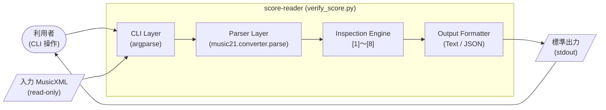
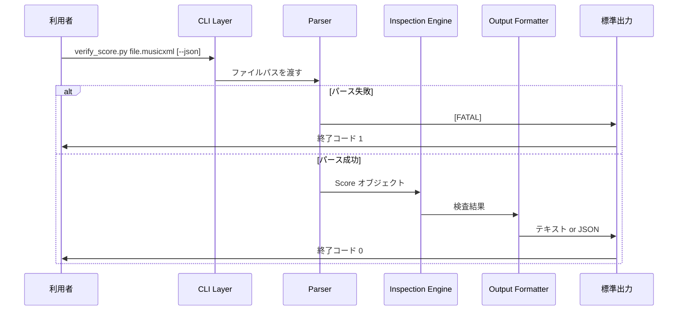

# Architecture Design（アーキテクチャ設計）

<!-- Document Info（文書情報） -->
| Item（項目） | Value（値） |
|---|---|
| Document ID（文書ID） | ARCH-001 |
| Version（バージョン） | 0.2 |
| Status（ステータス） | Draft |
| Created Date（作成日） | 2026-06-09 |
| Last Updated（最終更新日） | 2026-06-28 |
| Owner（管理者） | Takashi Oikawa |
| Related Documents（関連文書） | README.md / 02_REQUIREMENTS_DEFINITION.md / 03_DATA_AND_SECURITY_DESIGN.md / 04_UI_AND_FLOW_DESIGN.md / 06_OPERATION_AND_HANDOFF.md / legacy/SCORE_READER_BASIC_DESIGN.md / legacy/MULTI_OMR_BASIC_DESIGN.md |

---

## Table of Contents（目次）

1. [Purpose（目的）](#1-purpose目的)
2. [Scope（対象範囲）](#2-scope対象範囲)
3. [Out of Scope（対象外範囲）](#3-out-of-scope対象外範囲)
4. [Assumptions（前提条件）](#4-assumptions前提条件)
5. [Definition Details（定義内容）](#5-definition-details定義内容)
6. [Open Issues（未決事項）](#6-open-issues未決事項)
7. [Handoff to Detail Design（詳細設計への引き継ぎ）](#7-handoff-to-detail-design詳細設計への引き継ぎ)
8. [Change History（変更履歴）](#8-change-history変更履歴)

---

## 1. Purpose（目的）

本設計書群は、完成版 MusicXML 作成支援システムへ到達するための検証結果・設計判断・未確定事項を整理したプロトタイプ段階の設計ガイドラインである。本文書は**プロトタイプ検証段階**における `verify_score.py`（単一 MusicXML 構造検査の検証実装）のシステム構成・技術スタック・処理フロー・アーキテクチャ制約を定義し、実装フェーズの基準とすることを目的とする。

将来本実装候補（複数 MusicXML 比較、差分可視化、比較レポート生成）のアーキテクチャ方針は、本文書の Open Issues で管理する。本文書の対象読者は、設計者・実装者・プロジェクトオーナーである。

---

## 2. Scope（対象範囲）

| 対象 | 内容 |
|---|---|
| システム | score-reader プロトタイプ検証段階（`prototype/src/verify_score.py`） |
| 実行形態 | ローカル実行 CLI ツール（単一 Python スクリプト） |
| 処理対象 | 単一 MusicXML ファイルの内部整合性検査 |
| 出力 | 標準出力（テキスト形式 / JSON 形式） |
| 依存ライブラリ | `music21 10.3.0`（`prototype/requirements.txt` 参照） |

---

## 3. Out of Scope（対象外範囲）

| 対象外項目 | 理由 |
|---|---|
| 本番グレードのアーキテクチャ設計 | プロトタイプ検証段階を対象とする |
| データベース設計 | データを永続化しない |
| 複数 MusicXML の比較・自動統合 | 自動修正、自動統合、Web UI、原本 PDF 横並び画面は、現時点で定義する本実装段階には含めず、将来検討事項として扱う（TBD-001） |
| MusicXML 自動修正パイプライン | 同上 |
| GUI・Web UI・原本 PDF 横並び画面 | 同上（TBD-002） |
| 外部 OMR サービス API 連携 | プロトタイプ検証段階では外部 API 連携を持たない（TBD-003） |
| スケーリング・冗長化・クラウドデプロイ | ローカル実行ツールのためプロトタイプ検証段階では対象外 |

---

## 4. Assumptions（前提条件）

本文書の内容が成立するために必要な前提は `01_REQUEST_DEFINITION.md` §4 を継承する。以下はアーキテクチャ設計フェーズで追加する前提を示す。

**Prototype の境界**

- `verify_score.py` は Prototype / 技術検証用であり、正式完成版ではない
- プロトタイプの設計は「現技術で検出できることを最小限の構成で実現する」ことを優先する

**アーキテクチャ制約**

- 依存ライブラリは `music21 10.3.0` のみ
- 入力は 1 実行 = 1 MusicXML ファイル
- 出力は標準出力のみ。入力ファイルを変更しない（非破壊）
- 音高・音価・声部の正誤を自動判定しない
- `[WARN]` / `[ANOMALY]` 0 件であっても完全無欠を保証しない
- 本文書の v0.1 日付は、移行元 Legacy Source（`legacy/SCORE_READER_BASIC_DESIGN.md`）の初版コミット日（2026-06-07）を引き継ぐ

---

## 5. Definition Details（定義内容）

### 5.1 System Architecture Diagram（システム構成図）



#### 処理フロー（Processing Flow）



### 5.2 Technology Stack and Rationale（技術スタック・採用理由）

| Type（種別） | Technology（採用技術） | Version（バージョン） | Rationale（採用理由） |
|---|---|---|---|
| Language（言語） | Python | 3.x | music21 が Python で提供される。プロトタイプ実装の生産性が高い |
| Library（ライブラリ） | music21 | 10.3.0 | MusicXML 構造化読み取りに成熟した OSS（BSD-3-Clause） |
| CLI Parsing | argparse | Python 3.x 同梱 | 外部依存を増やさず `--json` を処理 |
| Framework（フレームワーク） | なし | — | プロトタイプ検証段階は単一スクリプト構成 |
| Database（DB） | なし | — | データを永続化しない |
| Infrastructure（インフラ） | ローカル Python 仮想環境 | `.venv` | プロトタイプ検証段階ではクラウド・コンテナ不要 |
| Package Management | pip + requirements.txt | — | `prototype/requirements.txt` で依存を固定 |

### 5.3 Module Structure and Layer Design（モジュール構成・レイヤー設計）

プロトタイプ検証段階は単一スクリプト（`verify_score.py`）で全機能を実装する。

```
prototype/
├── src/
│   └── verify_score.py
├── tests/
│   └── *.musicxml
└── requirements.txt
```

| コンポーネント | 責務 |
|---|---|
| CLI Layer | 引数解析・出力形式選択 |
| Parser Layer | MusicXML 読み込み。失敗時 `[FATAL]`・終了コード 1 |
| Inspection Engine | 検査 [1]〜[8]。推測しない・断定しない |
| Output Formatter | テキスト/JSON 出力。「完全無欠を保証しない」注記を含める |

#### 検査エンジン（Inspection Engine）

| 検査 ID | 機能 | 参照範囲 | 判定しないこと |
|---|---|---|---|
| [1] 移調楽器 | 移調情報の報告 | 全パート | 正誤の確定 |
| [2] 小節長 | 拍子との不一致検出 | 全パート・全小節 | どちらが正しいか |
| [3] 調号 | 調号の列挙 | **第 1 パートのみ** | 調号の正誤 |
| [4] テンポ/拍子 | 変化イベントの列挙 | **第 1 パートのみ** | テンポの正誤 |
| [5] 未確定要素 | `Unpitched` 件数 | 全パート | 完全無欠の保証 |
| [6] リハーサルマーク | 小節対応の列挙 | 全パート | マークの正誤 |
| [7] 和音音数 | 構成音数分布の報告 | 全パート | 何音であるべきか |
| [8] パート間小節数 | 小節数一致・不一致 | 全パート | どのパートが正しいか |

### 5.4 External Integration and API Design（外部システム連携・API設計方針）

プロトタイプ検証段階では外部公開 API を持たない。

| Integration Target / API Name（連携先 / API名） | Method（連携方式） | Purpose / Overview（用途・概要） |
|---|---|---|
| music21 | pip パッケージ | MusicXML 構造化読み取り |
| ローカルファイルシステム | OS ファイルアクセス | 入力 MusicXML 読み取り（read-only） |
| 標準出力 | print / json.dumps | 検査結果出力 |
| 外部 OMR サービス | score-reader スコープ外 | 利用者が PDF → MusicXML を取得 |

将来検討事項: 複数 MusicXML 比較（TBD-001）、外部 OMR API 連携（TBD-003）、Web UI（TBD-002）。

### 5.5 Scalability and Fault Tolerance（スケーラビリティ方針・障害対策）

| Aspect（観点） | Design Details（設計内容） |
|---|---|
| Scaling Policy（スケーリング方針） | プロトタイプ検証段階では対象外。ローカル実行ツール |
| Redundancy（冗長化） | プロトタイプ検証段階では対象外 |
| Failover（フェイルオーバー） | パース失敗時は `[FATAL]` 出力・終了コード 1 |
| Other Fault Tolerance（その他耐障害設計） | 入力ファイルの非破壊アクセス。警告 0 件時も注記を出力して誤解を防止 |

#### アーキテクチャリスク

| リスク | 対策方針 |
|---|---|
| music21 バージョン非互換 | `requirements.txt` で `10.3.0` に固定。更新時は再検証 |
| 単一スクリプト肥大化 | 将来検討事項として Inspection Engine を関数分離（TBD-004） |
| [3][4] 第 1 パート限定 | 出力に制約注記を含める（TBD-002） |
| OMR 出力の誤信 | Output Formatter で「完全無欠を保証しない」注記を必ず出力 |

### 5.6 Infrastructure and Environment（インフラ・環境構成）

| Environment（環境） | Configuration / Resources（構成・リソース概要） |
|---|---|
| Development / Verification（開発・検証） | Python 3.x（macOS / Linux）。`.venv`。`music21==10.3.0` |
| Staging（ステージング） | プロトタイプ検証段階では対象外 |
| Production（本番） | プロトタイプ検証段階では対象外 |

環境構築の詳細手順は `06_OPERATION_AND_HANDOFF.md` を参照。

---

## 6. Open Issues（未決事項）

| ID | Open Issue（未決事項） | Owner（担当者） | Due Date（期限） | Status（ステータス） |
|---|---|---|---|---|
| TBD-001 | 複数 MusicXML 比較・結果ファイル保存を将来検討事項で要件化する場合のアーキテクチャ設計 | Takashi Oikawa | 未定 | Open |
| TBD-002 | 検査 [3][4] を全パート対応へ拡張する実装方針 | Takashi Oikawa | 未定 | Open |
| TBD-003 | 外部 OMR サービス API 連携のコンポーネント設計 | Takashi Oikawa | 未定 | Open |
| TBD-004 | 単一スクリプトからのモジュール分割方針 | Takashi Oikawa | 未定 | Open |
| TBD-005 | music21（BSD-3-Clause）再配布時のライセンス表示方法 | Takashi Oikawa | 未定 | Open |
| TBD-006 | Windows 環境での動作確認 | Takashi Oikawa | 未定 | Open |

---

## 7. Handoff to Detail Design（詳細設計への引き継ぎ）

1. **「推測しない・断定しない」を実装で徹底**: 確定できない結果は `[WARN]` / `[INFO]` で列挙する。
2. **[3][4] の第 1 パート限定制約を明示**: 実装コメントと出力注記に含める。
3. **警告 0 件時の注記を省略しない**: Output Formatter に組み込む。
4. **music21 バージョンを `10.3.0` に固定**: 変更時は全検査項目を再検証する。

---

## 8. Change History（変更履歴）

| Version（バージョン） | Date（日付） | Changes（変更内容） | Author（変更者） |
|---|---|---|---|
| 0.1 | 2026-06-09 | 初版作成 | Takashi Oikawa |
| 0.2 | 2026-06-28 | legacy/05 を内容抽出元として正本記入・開発段階分類表記統一 | Takashi Oikawa |
