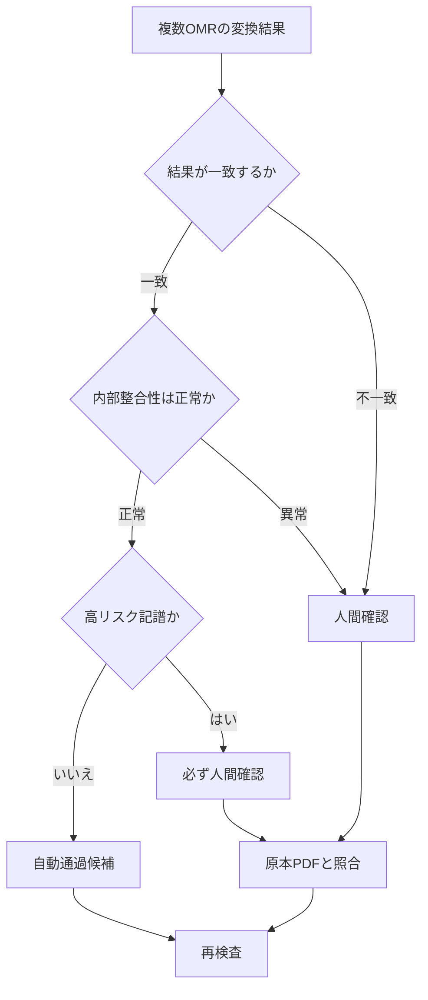
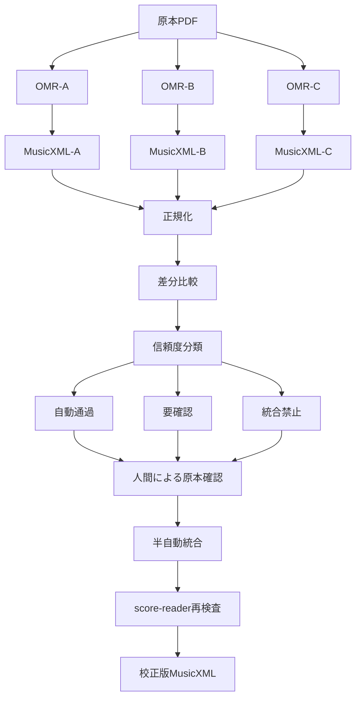
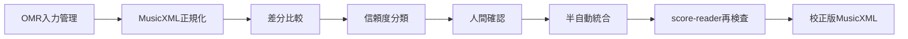
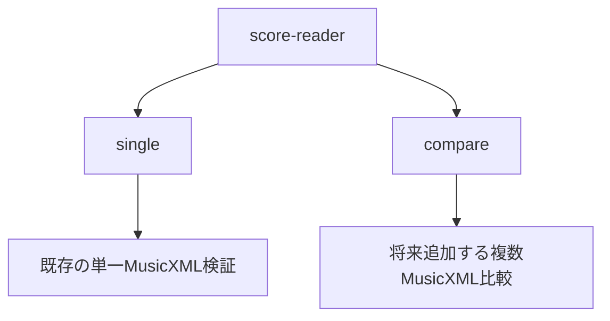
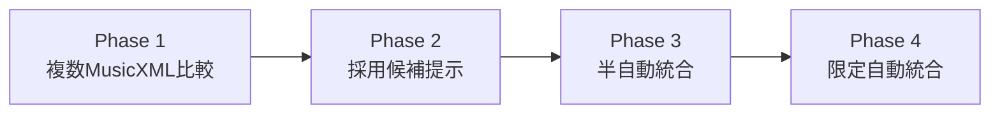

# 複数OMR比較・半自動統合 基本設計書

本書は、複数のOMR変換結果を比較し、人間の確認範囲を最小化しながら、安全に校正版MusicXMLへ近づける将来構想を整理する基本設計書である。現時点では設計のみを対象とし、機能実装は行わない。

## 0. 結論

- 単一OMRへ依存しない。
- 同じ原本PDFを複数OMRで変換する。
- 各MusicXMLを比較する。
- 人間は全件確認しない。
- 差分箇所、高リスク箇所、内部整合性異常だけを重点確認する。
- 推測による自動補完を禁止する。
- 最初に実装する候補はPhase 1の差分比較のみ。
- 半自動統合と限定自動統合は将来拡張とする。
- 最終的な正確性は原本PDFとの目視照合で担保する。

## 1. 目的

- 単一OMRへ依存せず、複数のPDF→MusicXML変換結果を比較する。
- 各OMRの得意分野を活用する。
- 人間が全件確認するのではなく、差分箇所、高リスク箇所、内部整合性異常だけを重点確認する。
- 推測による自動補完を避ける。
- 最終的な正確性は原本PDFとの目視照合で担保する。

## 2. 背景

- OMRごとに認識精度と得意分野が異なる。
- 音符骨格、小節構造、複数小節休符、テンポ、強弱記号、リハーサルマーク、タイ、スラー等で認識差が生じる。
- MusicXML形式自体が問題なのではなく、OMR段階で誤認識や欠落が混入する。
- 単一OMRの結果を無検査で正本にしてはいけない。

## 3. 基本方針



> 人間確認は全件ではなく、差分箇所、高リスク箇所、内部整合性異常へ限定する。

### 3.1 自動通過

複数OMRが一致し、内部整合性も正常な箇所。

条件例:

- 複数OMRで内容が一致
- 小節内音価合計が拍子と一致
- 小節番号が連続
- 前後小節との整合性がある
- パート間の小節数が一致

### 3.2 人間確認

OMRごとに結果が異なる箇所。

対象例:

- 音高
- 音価
- 休符
- 複数小節休符
- 小節番号
- リハーサルマーク
- テンポ
- 強弱記号

### 3.3 必ず人間確認

複数OMRが一致していても、原本確認を優先する高リスク記譜。

対象例:

- 連符
- 装飾音符
- 多声部
- 打楽器特殊記譜
- タイ
- スラー
- 複数小節休符
- 拍子変更箇所

## 4. 全体構造



```text
原本PDF
  ├─ OMR-A
  ├─ OMR-B
  └─ OMR-C
       ↓
各MusicXML
       ↓
正規化
       ↓
差分比較
       ↓
信頼度分類
  ├─ 自動通過
  ├─ 要確認
  └─ 統合禁止
       ↓
人間による原本確認
       ↓
半自動統合
       ↓
score-reader再検査
       ↓
校正版MusicXML
```

## 5. コンポーネント責務



### 5.1 OMR入力管理

- 同一PDFから生成された複数MusicXMLを管理する。
- OMR名、変換日時、入力条件、原本との対応を保持する。

### 5.2 MusicXML正規化

- OMRごとの表現差を吸収し、比較可能な内部形式へ変換する。
- XML文字列比較ではなく、意味構造で比較する。

### 5.3 差分比較

以下の単位で差分を抽出する。

- 楽譜全体
- パート単位
- 小節単位
- 拍単位
- 記号単位

### 5.4 信頼度分類

| 条件 | 分類 |
| ----------------- | ------ |
| 複数OMR一致 + 内部整合性正常 | 自動通過候補 |
| OMR間不一致 | 要確認 |
| 小節数不一致 | 統合禁止 |
| 音価不一致 | 要確認 |
| タイ・スラー接続先不一致 | 統合禁止 |
| 人間確認済み | 確定 |

### 5.5 半自動統合

- 人間が確認した採用結果だけを統合する。
- 採用元OMRを保持する。
- 人間確認済みであることを保持する。
- 推測で補完しない。

## 6. 自動統合の制約

### 6.1 自動統合候補

以下は、条件を満たす場合に限定して自動統合候補とする。

- タイトル
- パート名
- 調号
- 拍子
- テンポ
- リハーサルマーク
- 小節番号

### 6.2 自動統合禁止

以下は、人間確認なしで統合しない。

- 音高の競合
- 音価の競合
- 複数小節休符の競合
- タイ
- スラー
- 連符
- 装飾音符
- 多声部
- 打楽器特殊記譜

> 多数決だけで正解を確定しない。
> 複数OMRが同じ誤認識をする可能性があるため、高リスク記譜は必ず原本PDFで確認する。

## 7. 既存score-readerとの責務分離



```text
score-reader
  ├─ single
  │   └─ 既存の単一MusicXML検証
  │
  └─ compare
      └─ 将来追加する複数MusicXML比較
```

- 既存の検証項目 `[1]`〜`[8]` は変更しない。
- `single` は既存機能。
- `compare` は将来拡張。
- 比較機能は既存検証とは別責務として設計する。

## 7.1 実行環境（案）

> 実行環境は現時点では未確定。
> 以下は将来の実装検討時に用いる候補であり、確定仕様ではない。

| 項目 | 候補 |
| ---- | -------------------------- |
| 実行方式 | ローカルCLI |
| 将来拡張 | Web UI |
| 入力 | 原本PDF、複数MusicXML |
| 出力 | 差分レポート、確認対象一覧、校正版MusicXML |
| 解析形式 | MusicXML |
| 編集形式 | MuseScore形式を必要に応じて併用 |
| OMR | ACE Studio、Audiveris、その他候補 |

- Phase 1の要件定義時に確定する。
- CLIのみで十分か確認する。
- 原本PDFとの横並び表示が必要か確認する。
- Web UIが必要か確認する。
- 外部サービスへ著作権保護譜面を投入してよいか確認する。

## 8. 開発フェーズ



### Phase 1: 複数MusicXML比較

- 差分可視化のみ
- 自動統合なし

### Phase 2: 採用候補提示

- 採用候補を表示
- 人間が判断

### Phase 3: 半自動統合

- 人間が確認した箇所だけ統合
- 出典保持

### Phase 4: 限定自動統合

- 安全条件を満たす箇所のみ自動採用
- 高リスク箇所は対象外

> 最初に実装する候補はPhase 1の差分比較のみ。
> 完全自動統合は、比較結果と誤認識傾向を確認した後に判断する。

## 9. 非機能要件

- 原本PDFを正本として保持する。
- 統合後も採用元OMRを追跡可能にする。
- 人間確認済み箇所を識別可能にする。
- 著作権保護された譜面をGitHubへ登録しない。
- GitHub上のテスト素材はパブリックドメインに限定する。
- 推測による自動補完を禁止する。
- 異常0件でも完全無欠を主張しない。

追加要件:

- APIキー、トークン、秘密鍵、個人情報をGit管理しない。
- 外部OMRサービスへ譜面を送信する場合は、利用規約と著作権条件を確認する。

## 10. 未確定事項

- 対象を単一パート譜だけに限定するか。
- 将来フルスコアを扱うか。
- 比較対象OMRを何種類とするか。
- 最初の比較単位を小節までとするか、音符まで含めるか。
- CLIのみとするか、将来Web UIを追加するか。
- 原本PDFとの横並び比較画面を作るか。
- 統合後の正本をMusicXMLとするか、MuseScore形式も保持するか。

追加の未確定事項:

- 外部OMRサービスの利用条件をどのように管理するか。
- 市販譜由来の中間ファイルをどこへ保存するか。
- 原本PDFとMusicXMLの対応位置をどの単位で保持するか。

## 11. 採用判断

- 最初から完全自動統合を目指さない。
- 最初に実装する候補はPhase 1の差分比較のみ。
- 人間の確認対象を最小化することを主目的とする。
- 自動化よりも、誤統合を防止することを優先する。

追加の採用判断:

- 原本PDFを正本として保持する。
- 判断できない箇所は要確認として残す。
- 推測による補完は行わない。
