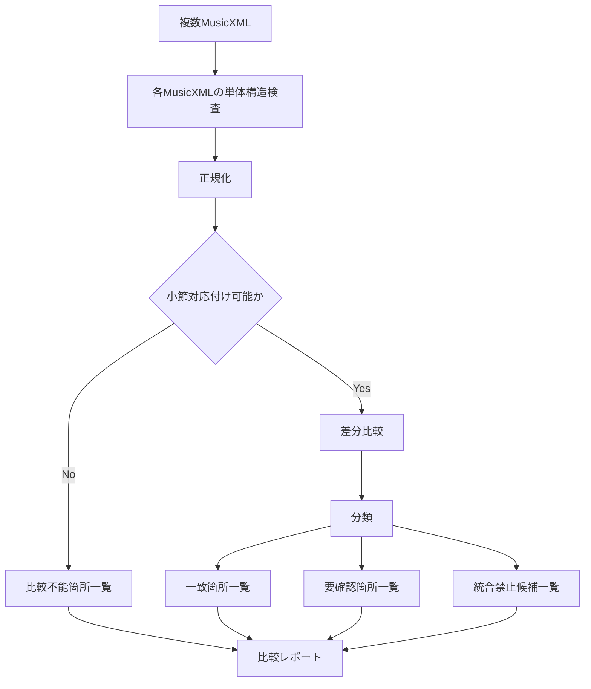
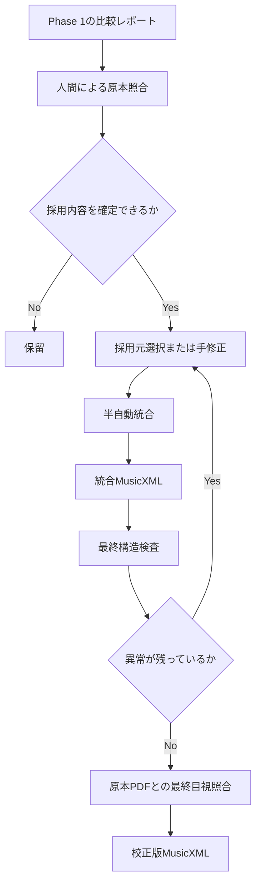
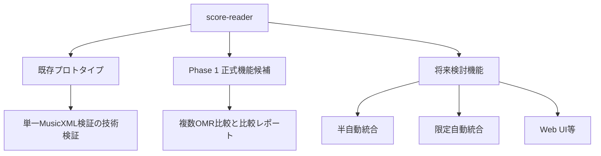
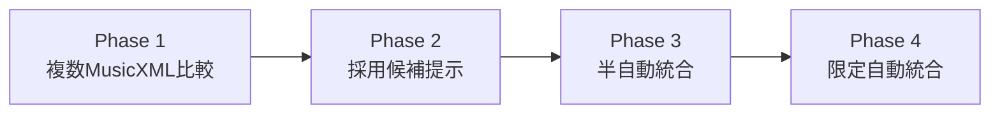

# 複数OMR比較・確認対象絞り込み 基本設計書

本書は、複数のOMR変換結果を比較し、人間の確認範囲を最小化しながら、安全に校正版MusicXMLへ近づける将来構想を整理する基本設計書である。現時点では設計のみを対象とし、機能実装は行わない。

## 0. 結論

- 単一OMRの出力を無条件で正本として採用しない。
- 複数OMRの出力を比較し、人間確認が必要な箇所を絞り込む。
- 現在の単一MusicXML検証はプロトタイプとして扱う。
- Phase 1では、複数MusicXML比較と差分可視化までを対象とする。

## 1. 開発目的

- OMRごとの得意分野を活用する。
- 人間が確認する範囲を必要最小限にする。
- 推測による自動補完を避ける。
- 原本PDFを正本として保持する。
- 校正可能かつ再利用可能なMusicXML生成を支援する。

## 2. 問題分析

### 2.1 現在の問題

```text
原本PDF
  ↓
単一OMR
  ↓
MusicXML
  ↓
そのまま採用
```

この方法では、OMR由来の誤認識や欠落を見逃す可能性がある。

### 2.2 誤認識が発生する要素

| 要素 | 問題例 |
|------|--------|
| 音符 | 音高、音価の誤認識 |
| 休符 | 休符種別の誤認識 |
| 複数小節休符 | 8小節休符を1小節休符として扱う |
| 小節番号 | 欠落、重複、連番崩れ |
| 拍子・調号 | 欠落、位置ずれ |
| テンポ | 欠落 |
| 強弱記号 | 欠落 |
| リハーサルマーク | 欠落、位置ずれ |
| タイ・スラー | 欠落、接続先誤り |
| 連符・装飾音符 | 構造誤認識 |
| 多声部・打楽器 | 表現構造の誤認識 |

### 2.3 問題の本質

- MusicXML形式が悪い → **誤り**
- OMR認識結果に誤認識・欠落が混入する → **正しい**

### 2.4 単一OMRでは不足する理由

- OMRごとに認識精度と得意分野が異なる。
- 同じ譜面でも認識結果が異なる。
- 単一結果だけでは誤認識を判断できない。
- MusicXML内部整合性が正常でも、原本PDFと異なる可能性がある。

## 3. 解決案の検討

### 3.1 案A: 単一OMRを採用する

| 観点 | 内容 |
|------|------|
| メリット | 単純、低コスト、処理が速い |
| デメリット | 誤認識の見逃しが残る。OMR固有の弱点を補えない |
| 判定 | 単独採用は不十分 |

### 3.2 案B: 複数OMRの多数決で決める

| 観点 | 内容 |
|------|------|
| メリット | 単一OMR依存を減らせる。一致箇所を抽出しやすい |
| デメリット | 複数OMRが同じ誤認識をする可能性がある。構造差が大きい場合は比較自体が成立しない |
| 判定 | 多数決のみでは不十分 |

### 3.3 案C: 複数OMRを比較し、必要箇所だけ人間が確認する

| 観点 | 内容 |
|------|------|
| メリット | 確認範囲を絞れる。OMRごとの得意分野を活用できる。誤認識を黙殺しない |
| デメリット | 比較処理が必要。小節対応付けが難しい場合がある。完全自動化にはならない |
| 判定 | **採用** |

## 4. 解決不能な問題点の確定

### 4.1 MusicXML単体では確定できない問題

| 問題 | 理由 |
|------|------|
| どのOMR結果が正しいか | 原本PDFを見ないと確定できない |
| 欠落した音符の正解 | MusicXMLだけでは復元不能 |
| 複数小節休符の正確な数 | OMR間差分だけでは断定不能 |
| タイ・スラーの正しい接続 | 表現意図を含むため、人間による原本照合が必要 |
| 連符・装飾音符の正解 | 原本照合が必要 |
| 多声部の正しい構造 | OMR間の単純比較では不足 |
| 打楽器特殊記譜 | 楽器固有の解釈が必要 |
| 複数OMR一致時の正しさ | 同じ誤認識が起きる可能性がある |

### 4.2 比較自体が成立しないケース

| ケース | 扱い |
|--------|------|
| 小節番号がすべて 0 | 比較不能箇所 |
| 小節数が大幅に異なる | 比較不能箇所 |
| 複数小節休符が崩れている | 要確認箇所または比較不能箇所 |
| 拍子構造が大きく異なる | 要確認箇所 |
| パート数が一致しない | 比較不能箇所 |
| 楽譜構造が大きく異なる | 比較不能箇所 |

### 4.3 設計原則

```text
判断できない
  ↓
推測して補完しない
  ↓
要確認箇所 または 比較不能箇所 として残す
```

### 4.4 用語の統一

| 使用する表現 | 使用条件 |
|--------------|----------|
| `自動通過候補` | Phase 1の一致箇所（比較レポート上は一致箇所一覧として出力） |
| `要確認箇所` | 原本確認が必要 |
| `比較不能箇所` | 対応付け不可 |
| `統合禁止候補` | 将来自動統合してはいけない |
| `保留` | 人間でも判断不能または対応延期 |

以下は使用しない。

- `自動通過`
- `自動確定`
- 終了条件のない `再検査`

## 5. 代替案（実現可能案）

### 5.1 Phase 1 比較フロー

Phase 1の終了点は **比較レポート** とする。以下は Phase 1 の対象外である。

- 原本PDFとの照合
- 人間による採用元選択
- 人間による手修正
- 再比較ループ
- 半自動統合
- MusicXML書換え



- `一致箇所一覧` は、複数OMRで一致し単体構造検査も通過した箇所（`自動通過候補`）を示す。
- `要確認箇所一覧` は、原本確認が必要な箇所を示す。
- `比較不能箇所一覧` は、小節対応付けが成立しない箇所を示す。
- `統合禁止候補一覧` は、将来自動統合してはいけない箇所を示す（Phase 1では一覧化のみ）。

### 5.2 Phase 1の成果物（比較レポートの構成）

- 各MusicXMLの単体構造検査結果
- 小節対応付け可否
- 一致箇所一覧（`自動通過候補`）
- 要確認箇所一覧
- 比較不能箇所一覧
- 統合禁止候補一覧
- OMRごとの傾向一覧

### 5.3 Phase 1で行わないこと

- 原本PDFとの照合
- 人間による採用元選択
- 人間による手修正
- 再比較ループ
- MusicXML自動修正・書換え
- 自動統合・半自動統合
- MuseScore書換え
- Web UI
- 原本PDFとの横並び画面
- 多数決による自動採用

### 5.4 将来統合フロー（Phase 2以降）



- 異常が残る場合のみ、人間修正（採用元選択または手修正）へ戻る。
- 異常が解消したら、原本PDFとの最終目視照合へ進む。
- 人間でも判断不能な場合は `保留` とする。
- 異常0件でも完全無欠を主張しない。

## 6. 結論

- 完全自動統合 → **採用しない**
- 複数OMRの多数決 → **採用しない**
- 複数OMR比較 + 差分抽出 + 人間による重点確認 → **採用**

以下を明記する。

- 単一OMRへ依存しない。
- OMRごとの得意分野を活用する。
- 人間は全件確認しない。
- 差分箇所、高リスク箇所、比較不能箇所、要確認箇所だけを重点確認する。
- 推測で補完しない。
- 原本PDFを正本として保持する。
- 自動化より誤統合防止を優先する。

## 7. 完成後に得られる効果

本プロジェクトの目的は、OMR変換結果に誤認識が含まれることを理由に、OMRそのものを不採用とすることではない。重要なのは、完全自動変換を前提とするのではなく、複数OMRの比較、内部整合性検査、差分抽出を組み合わせることで、人間が確認すべき箇所を必要最小限まで絞り込むことである。これにより、全小節・全音符を最初から目視確認または手入力するのではなく、要確認箇所、高リスク記譜、比較不能箇所だけを重点的に確認できる。本プロジェクトを利用することで、OMRの不完全性を前提としながらも、最小限の手作業で、校正可能かつ再利用可能なMusicXMLデータを生成できる。

### 7.1 効果の要点

| 観点 | 効果 |
|------|------|
| 手作業削減 | 全件確認ではなく、要確認箇所だけを重点確認できる |
| 精度向上 | 単一OMRの誤認識を、複数OMR比較と内部検査で検出できる |
| 実用性 | 不完全なOMR出力を、校正可能な下書きとして活用できる |
| 安全性 | 推測による自動補完を避け、判断不能箇所を `保留` として明示できる |
| 再利用性 | 校正後のMusicXMLを、編集、再生、解析、教材化へ展開できる |

## 8. 現在のプロトタイプ

### 8.1 位置づけ

- リポジトリ名は変更しない: **score-reader**
- 既存の `src/verify_score.py` は、単一MusicXML検証が技術的に可能か確認するための**プロトタイプ**である。
- **正式完成版ではない。**

### 8.2 プロトタイプで確認済みの知見

| No. | 検証項目 |
|-----|----------|
| [1] | 移調楽器テーブル |
| [2] | 小節長の検算 |
| [3] | 調号 |
| [4] | テンポ・拍子イベント |
| [5] | 未確定要素の列挙 |
| [6] | リハーサルマークと小節番号の対応 |
| [7] | 和音の音数チェック |
| [8] | パート間小節数整合チェック |

### 8.3 重要な扱い

- 既存プロトタイプの知見は再利用する。
- 既存コードをそのまま正式採用するかは未確定。
- 現段階では既存コードを改修しない。
- Phase 1 正式機能候補の詳細設計後に、再利用方法を判断する。

## 9. 将来の正式機能と機能分類

複数OMR比較、差分抽出、人間確認対象の絞り込み、将来的な半自動統合は、**同一 score-reader リポジトリ内**で段階的に設計・追加する。別プロジェクトへ分離しない。別GitHubリポジトリを作成しない。

### 9.1 プロトタイプ・Phase 1・将来検討の関係



### 9.2 Phase 1 正式機能候補

- 複数MusicXML入力
- 単体構造検査
- 正規化
- 比較可能性判定
- 差分比較
- 比較不能箇所一覧
- 要確認箇所一覧（人間確認対象一覧）
- 比較レポート

### 9.3 将来検討機能

- 採用候補提示
- 半自動統合
- 限定自動統合
- Web UI
- MuseScore連携
- 原本PDFとの横並び表示

### 9.4 将来正式機能の責務（Phase 2以降を含む）

| コンポーネント | 責務 |
|----------------|------|
| 複数OMR入力管理 | 同一PDFから生成された複数MusicXMLを管理する |
| MusicXML正規化 | OMRごとの表現差を吸収する |
| 比較可能性判定 | 小節対応付けが成立するか確認する |
| 差分比較 | 小節、拍、記号単位で差分を抽出する |
| 比較不能箇所抽出 | 推測で対応付けできない箇所を `比較不能箇所` として明示する |
| 要確認箇所絞り込み | 原本確認が必要な箇所を `要確認箇所` として一覧化する |
| 半自動統合 | 人間確認済み要素だけを将来的に統合する |

### 9.5 自動統合の制約（将来検討）

#### 自動統合候補（条件を満たす場合に限定）

- タイトル
- パート名
- 調号
- 拍子
- テンポ
- リハーサルマーク
- 小節番号

#### 統合禁止候補（人間確認なしで統合しない）

- 音高の競合
- 音価の競合
- 複数小節休符の競合
- タイ
- スラー
- 連符
- 装飾音符
- 多声部
- 打楽器特殊記譜

> 多数決だけで正解を確定しない。複数OMRが同じ誤認識をする可能性があるため、高リスク記譜は必ず原本PDFで確認する。

#### 高リスク記譜（要確認箇所として扱う例）

- 連符
- 装飾音符
- 多声部
- 打楽器特殊記譜
- タイ
- スラー
- 複数小節休符
- 拍子変更箇所

## 10. システム全体構造（概略）

- 入力（複数MusicXML）→ 比較 → 人間確認支援（比較レポート）→ 将来検討: 半自動統合 → 最終確認、の段階構造とする。
- Phase 1の対象は **比較レポート出力** まで。
- 半自動統合以降は **将来検討機能**。
- 詳細な分岐は各Phaseの図（§5.1 Phase 1比較フロー、§5.4 将来統合フロー）を参照する。

## 11. 実行環境（案）

> 実行環境は現時点では未確定。
> 以下は将来の実装検討時に用いる候補であり、**確定仕様ではない**。

| 項目 | 候補 |
|------|------|
| 実行方式 | ローカルCLI |
| 将来拡張 | Web UI（将来検討機能） |
| 入力 | 原本PDF、複数MusicXML |
| 出力 | 比較レポート、要確認箇所一覧、比較不能箇所一覧 |
| 解析形式 | MusicXML |
| 編集形式 | MuseScore形式を必要に応じて併用（将来検討機能） |
| OMR | ACE Studio、Audiveris、その他候補 |

- Phase 1の要件定義時に確定する。
- CLIのみで十分か確認する。
- 原本PDFとの横並び表示が必要か確認する（将来検討機能）。
- Web UIが必要か確認する（将来検討機能）。
- 外部サービスへ著作権保護譜面を投入してよいか確認する。

## 12. 非機能要件

| 項目 | 要件 |
|------|------|
| 原本保持 | 原本PDFを正本として保持する |
| 追跡性 | 採用元OMRを追跡可能にする |
| 再現性 | OMR名、バージョン、変換日時、入力条件を保持する |
| 入力識別 | 原本PDFのハッシュ値を保持する |
| 出力識別 | 各MusicXMLのハッシュ値を保持する |
| 監査性 | 採用元OMR、人間確認、修正履歴を記録する |
| 非破壊性 | **元MusicXMLを直接上書きしない** |
| 比較不能時の安全性 | 推測で位置合わせせず、`比較不能箇所` として報告する |
| 著作権 | 著作権保護された譜面をGitHubへ登録しない |
| テスト素材 | GitHub上のテスト素材はパブリックドメインに限定する |
| 推測防止 | 推測による自動補完を禁止する |
| 品質保証 | 異常0件でも完全無欠を主張しない |
| 秘匿情報 | APIキー、トークン、秘密鍵、個人情報をGit管理しない |

追加要件:

- 外部OMRサービスへ譜面を送信する場合は、利用規約と著作権条件を確認する。

## 13. 未確定事項

- 対象を単一パート譜だけに限定するか。
- 将来フルスコアを扱うか。
- 比較対象OMRを何種類とするか（OMR数は固定しない）。
- 最初の比較単位を小節までとするか、音符まで含めるか。
- CLIのみとするか、将来Web UIを追加するか（将来検討機能）。
- 原本PDFとの横並び比較画面を作るか（将来検討機能）。
- 統合後の正本をMusicXMLとするか、MuseScore形式も保持するか。
- 外部OMRサービスの利用条件をどのように管理するか。
- 市販譜由来の中間ファイルをどこへ保存するか。
- 原本PDFとMusicXMLの対応位置をどの単位で保持するか。
- 既存プロトタイプのコードを、Phase 1 正式機能候補でどのように再利用するか。

## 14. 開発フェーズ



| Phase | 内容 | 自動統合 |
|-------|------|----------|
| Phase 1 | 複数MusicXML比較、差分可視化、**比較レポート出力** | 行わない |
| Phase 2 | 採用候補提示、人間判断（将来検討機能の一部） | 行わない |
| Phase 3 | 人間確認済み箇所だけ統合、出典保持（将来検討機能） | 限定的 |
| Phase 4 | 安全条件を満たす箇所だけ自動採用（将来検討機能） | 条件付き |

- 最初に設計・実装対象とする候補は **Phase 1 のみ**（終了点: 比較レポート）。
- 完全自動統合は、比較結果と誤認識傾向を確認した後に判断する。
