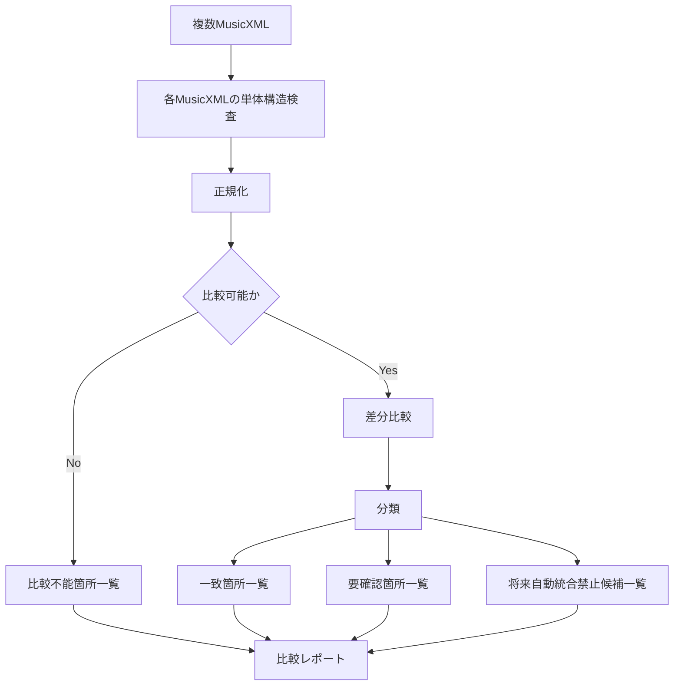

# score-reader 基本設計書

## 1. 本書の位置づけ

本書は、`score-reader` の基本設計に関する正本である。

`score-reader` は、同一の原本 PDF から生成された複数の OMR 変換結果を比較し、人間が確認すべき箇所を絞り込むための設計・検証プロジェクトである。

現行の Python ソースは、単一 MusicXML の構造検査が技術的に可能かを確認するためのプロトタイプである。現段階では、正式実装として扱わない。

## 2. 開発目的

本システムは、紙の楽譜または PDF から OMR により生成された MusicXML に含まれる誤認識候補を、複数 OMR の比較、MusicXML 内部の構造検査、および記譜上の高リスク領域の抽出によって可視化する。

疑わしい箇所、比較不能な箇所、機械的に正誤を判断できない箇所を黙殺せず、要確認箇所として明示する。

人間が全小節・全音符を最初から同じ密度で精査する作業を避け、確認の優先順位を付けることで、原本 PDF との照合作業を効率化するのを目的としている。

本システムは、誤認識候補の見落としを可能な限り抑制し、**偽陰性 0% を目指す。**

ただし、アラートが付与されていない箇所について、誤認識が存在しないことを保証するものではない。

最終的な品質保証には、原本 PDF との照合を必要とする。

## 3. 背景と問題

### 3.1 単一 OMR 依存の問題

```text
原本PDF
  ↓
単一OMR
  ↓
MusicXML
  ↓
そのまま採用
```

OMR の出力には、誤認識、欠落、位置ずれ、構造崩れが混入する可能性がある。
MusicXML 内部の整合性が保たれていても、原本 PDF と異なる場合がある。

### 3.2 誤認識が発生し得る要素

| 要素 | 問題例 |
|---|---|
| 音符 | 音高、音価の誤認識 |
| 休符 | 休符種別の誤認識 |
| 複数小節休符 | 小節数の誤認識 |
| 小節番号 | 欠落、重複、連番崩れ |
| 拍子・調号 | 欠落、位置ずれ |
| テンポ | 欠落 |
| 強弱記号 | 欠落 |
| リハーサルマーク | 欠落、位置ずれ |
| タイ・スラー | 欠落、接続先誤り |
| 連符・装飾音符 | 構造誤認識 |
| 多声部・打楽器 | 表現構造の誤認識 |

## 4. 基本方針

```text
判断できない
  ↓
推測して補完しない
  ↓
要確認箇所・比較不能箇所・保留として残す
```

### 4.1 保守的な判定

誤認識の可能性を機械的に否定できない箇所は、要確認箇所として扱う。

検査処理は、疑わしい箇所を黙殺しない。比較不能、入力不足、解析不能、判定条件未対応の場合も、正常として通過させず、要確認または保留として記録する。

### 4.2 アラートの意味

アラートは、誤認識が確定したことを意味しない。

アラートは、人間が原本 PDF と照合すべき優先確認対象を示す。

アラートが付与されていない箇所も、誤認識が存在しないことを保証しない。

### 4.3 原本保持と非破壊性

原本 PDF および入力 MusicXML は変更しない。

Phase 1 では、検査結果を比較レポートとして出力する。

### 4.4 自動化の制約

推測による自動補完を行わない。

多数決だけで正解を確定しない。

異常が検出されない場合も、完全無欠と主張しない。

## 5. 対象範囲

### Phase 1 の対象

- 複数 MusicXML の入力。
- 各 MusicXML の単体構造検査。
- 比較前の正規化。
- 比較可能性の判定。
- 差分比較。
- 一致箇所、要確認箇所、比較不能箇所の分類。
- 記譜上の高リスク領域の抽出。
- 比較レポートの生成。

### Phase 1 の終了点

```text
比較レポートの生成
```

## 6. 対象外

Phase 1 では、以下を行わない。

- 原本 PDF との照合。
- 人間による採用元選択。
- 人間による手修正。
- 再比較ループ。
- MusicXML の自動修正、書換え。
- 自動統合、半自動統合。
- 多数決による自動採用。
- Web UI。
- 原本 PDF との横並び画面。
- MuseScore 書換え。
- アラート付き派生 MusicXML の生成。

## 7. 用語定義

| 用語 | 定義 |
|---|---|
| 原本 PDF | OMR 変換前の正本となる楽譜 PDF |
| OMR | 楽譜画像または PDF を MusicXML 等へ変換する外部認識処理 |
| 一致箇所 | 複数 OMR の比較結果が一致し、単体構造検査でも問題が検出されない箇所 |
| 要確認箇所 | 原本 PDF による確認が必要な箇所 |
| 比較不能箇所 | 対応付けが成立せず、比較できない箇所 |
| 保留 | 人間でも判断できない、または判断を延期する箇所 |

## 8. システム全体構造



## 9. Phase 1 設計対象

| コンポーネント | 責務 |
|---|---|
| 複数 OMR 入力管理 | 同一原本 PDF に由来する複数 MusicXML を関連付ける |
| 単体構造検査 | 各 MusicXML の内部整合性を検査する |
| 正規化 | OMR ごとの表現差を比較可能な形へ整える |
| 比較可能性判定 | 小節、パート等の対応付けが成立するか判定する |
| 差分比較 | 比較可能な範囲の差分を抽出する |
| 分類 | 一致、要確認、比較不能等に分類する |
| 高リスク領域抽出 | 構造的には正常であっても誤認識の危険が高い記譜要素を抽出する |
| 比較レポート生成 | 人間が確認すべき情報を一覧化する |

## 10. 比較レポート

比較レポートには、少なくとも以下を含める。

- 各 MusicXML の単体構造検査結果。
- 入力元 OMR の識別情報。
- 原本 PDF と各 MusicXML の識別情報。
- 比較可能性の判定結果。
- 一致箇所一覧。
- 要確認箇所一覧。
- 比較不能箇所一覧。
- 将来自動統合禁止候補一覧。
- 高リスク領域一覧。
- 判定不能箇所一覧。
- 使用できなかった検査条件一覧。
- OMR ごとの傾向一覧。

## 11. 将来フェーズ

### Phase 1（確定）

Phase 1 の対象は第5章に記載のとおりである。終了点は比較レポートの生成とする。

### Phase 2 以降（未確定）

Phase 2 以降は、現時点では未確定の将来検討事項である。

- 採用候補提示、人間判断支援、統合、自動採用は将来検討事項である。
- 現段階では実施可否を確定しない。
- 詳細は [OPEN_ISSUES.md](../project/OPEN_ISSUES.md) で管理する。

詳細設計へ進む前に、Phase 1 の範囲だけを確定する。Phase 1 と将来検討事項を混同しない。

## 12. 現行プロトタイプの位置づけ

- 現行ソースは、単一 MusicXML 検証の技術検証用プロトタイプである。
- 正式完成版ではない。
- 現段階では改修しない。
- 現行ソースを正式実装へ流用するかは未確定である。
- 詳細設計後に、再利用、置換、廃止のいずれとするか判断する。

## 13. 非機能要件

| 項目 | 要件 | 適用時期 |
|---|---|---|
| 原本保持 | 原本 PDF を正本として保持する | プロジェクト全体 |
| 再現性 | OMR 名、バージョン、変換日時、入力条件を保持する | Phase 1 |
| 入力識別 | 原本 PDF のハッシュ値を保持する | Phase 1 |
| 出力識別 | 各 MusicXML のハッシュ値を保持する | Phase 1 |
| 非破壊性 | 元 MusicXML を直接上書きしない | プロジェクト全体 |
| 比較不能時の安全性 | 推測で位置合わせせず、比較不能箇所として報告する | Phase 1 |
| 推測防止 | 推測による自動補完を禁止する | プロジェクト全体 |
| 品質保証 | 異常 0 件でも完全無欠を主張しない。最終的な品質保証には、原本 PDF との照合を必要とする | プロジェクト全体 |
| 偽陰性抑制 | 誤認識候補の見落としを可能な限り抑制し、偽陰性 0% を目指す | プロジェクト全体 |
| 安全宣言禁止 | アラートがない箇所について、誤認識が存在しないことを保証しない | プロジェクト全体 |
| 判定不能時の扱い | 検査不能、解析不能、入力不足を正常扱いせず、要確認または保留として報告する | Phase 1 |
| 秘匿情報 | API キー、トークン、秘密鍵、個人情報を Git 管理しない | プロジェクト全体 |

## 14. セキュリティ・著作権

- 著作権保護された譜面を GitHub へ登録しない。
- GitHub 上のテスト素材は、パブリックドメインに限定する。
- 外部 OMR サービスへ譜面を送信する場合は、利用規約と著作権条件を確認する。
- API キー、トークン、秘密鍵、個人情報をソース、ログ、Git 管理対象へ含めない。

## 15. 未確定事項

未確定事項の一覧と判断時期は [OPEN_ISSUES.md](../project/OPEN_ISSUES.md) で管理する。

Phase 2 以降の実施可否、採用候補提示、統合支援、条件付き自動採用の検討も含め、現段階では確定しない。

## 16. 詳細設計へ進む条件

- 比較対象となる複数 OMR の候補が整理されている。
- 同一原本 PDF から生成した複数 MusicXML のサンプルが用意されている。
- 正常系、差分あり、比較不能の代表ケースが用意されている。
- テスト素材がパブリックドメインに限定されている。
- 外部 OMR サービスを使用する場合は、利用規約と著作権条件を確認している。
